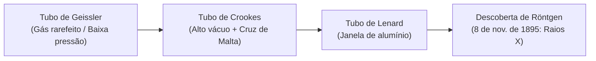

Antes de operar mesas de comando computadorizadas, detectores digitais de alta resolução e equipamentos de tomografia, todo técnico em radiologia precisa compreender como a física do século XIX abriu as portas para uma das maiores revoluções da história da medicina.

Na **UC1 (Unidade Curricular 1)** do curso técnico no Senac, iniciamos nossa jornada pela própria raiz da especialidade: o que é a radiologia e como experimentos com eletricidade em tubos de vácuo culminaram na descoberta acidental dos raios X.

---

## 1. O que Significa Radiologia?

Etimologicamente, o termo é composto por duas raízes clássicas:
* **_Radius_** (latim): Raio, emissão de feixe ou radiação divergente a partir de um centro.
* **_Logos_** (grego): Estudo, ciência, discurso ou razão.

> **Definição Contemporânea**: A **Radiologia** é a especialidade médica e técnico-científica dedicada ao estudo, geração e aplicação de diferentes formas de energia e radiações (ionizantes e não ionizantes) para diagnóstico anatômico/funcional e intervenção terapêutica (como a radioterapia e radiologia intervencionista).
{: .prompt-info }

---

## 2. O Cenário Científico: A Era dos Tubos de Descarga

Na segunda metade do século XIX, os físicos estavam obcecados em compreender como a eletricidade se comportava ao atravessar recipientes de vidro sob vácuo extremo contendo gases rarefeitos.



### A Contribuição de Sir William Crookes (1875)
O químico e físico britânico **Sir William Crookes** aperfeiçoou as bombas de vácuo mecânicas e construiu ampolas seladas com dois eletrodos metálicos submetidos a altíssimas diferenças de potencial (milhares de volts gerados por bobinas de Ruhmkorff):

* O polo negativo foi chamado de **Catodo**.
* O polo positivo foi chamado de **Anodo**.

Ao aplicar a descarga elétrica no interior do tubo rarefeito, uma radiação invisível partia do catodo e colidia contra o vidro oposto, gerando uma luminescência verde-amarelada fosforescente. 

Para demonstrar que essa emissão tinha trajetória retilínea e transportava massa e quantidade de movimento, Crookes introduziu um obstáculo metálico em formato de cruz (**a Cruz de Malta**). A sombra nítida projetada na parede de vidro comprovou a natureza corpuscular do feixe, batizado na época como **Raios Catódicos** — partículas de carga negativa mais tarde identificadas por **J.J. Thomson em 1897** como **elétrons**, ao medir experimentalmente sua relação carga/massa.

---

## 3. O Tubo de Philipp von Lenard (1894)

O físico alemão **Philipp von Lenard** deu o passo seguinte: queria descobrir se os raios catódicos conseguiam ultrapassar o vidro do tubo e interagir com o ambiente externo.

* Para isso, instalou uma folha extremamente fina de alumínio na extremidade do tubo — a famosa **Janela de Lenard**.
* Ele observou que os raios catódicos conseguiam escapar alguns centímetros para fora do tubo no ar atmosférico, sensibilizando papéis fotográficos e telas fluorescentes a curtas distâncias.

Lenard estava muito próximo da descoberta dos raios X, mas suas ampolas com janelas metálicas atenuavam e mascaravam a radiação penetrante secundária.

---

## 4. 8 de Novembro de 1895: O Experimento de Wilhelm Conrad Röntgen

Na tarde de **8 de novembro de 1895**, no Instituto de Física da Universidade de Würzburg (Alemanha), o físico alemão **Wilhelm Conrad Röntgen** trabalhava sozinho em seu laboratório escuro, investigando os raios catódicos com uma ampola de Hittorf-Crookes.

Para evitar que a luz visível da luminescência do vidro interferisse nas suas observações ópticas, Röntgen envolveu todo o tubo de vidro com um **papelão preto e espesso**.

```text
[Tubo de Crookes coberto com papelão preto] ─── (Feixe invisível de Raios X) ───> [Tela de Platinocianeto de Bário Fluorescendo]
```

Ao acionar a bobina de alta tensão, Röntgen notou algo inexplicável no canto do laboratório:
1. Uma placa de papel revestida com cristais de **platinocianeto de bário**, localizada a mais de 1 metro de distância, começou a **brilhar no escuro por fluorescência**.
2. Ele desligou a corrente: a tela apagou. Ligou novamente: a tela acendeu.
3. Como os raios catódicos sabidamente não atravessavam nem o papelão nem distâncias superiores a poucos centímetros no ar, Röntgen concluiu: **havia um novo tipo de raio desconhecido sendo gerado no choque dos elétrons contra o vidro**.

Por não saber a natureza física exata daquela radiação eletromagnética, batizou-a com a incógnita matemática: **Raios X**.

---

## 5. A Primeira Radiografia Médica da História

Nas semanas seguintes, Röntgen trancou-se no laboratório para desvendar as propriedades dos Raios X. Ele testou diferentes barreiras entre o tubo e a placa fotográfica: papel, madeira, blocos de borracha e folhas de alumínio — todos eram atravessados com facilidade. Apenas o **chumbo** bloqueava completamente o feixe.

Em **22 de dezembro de 1895**, Röntgen convidou sua esposa, **Anna Bertha Ludwig Röntgen**, para participar do experimento definitivo:

* Posicionou a mão esquerda de Bertha sobre uma placa fotográfica de vidro e expôs o conjunto ao feixe por cerca de **15 minutos**.
* A imagem revelada mostrou com incrível detalhamento a estrutura óssea das falanges e metacarpos, além do contorno denso e radiopaco de sua **aliança de casamento**.

Ao ver pela primeira vez o esqueleto de sua própria mão viva na chapa fotográfica, Bertha exclamou assustada:
> *"Vi a minha própria morte!"*

---

## 6. O Legado e o Primeiro Prêmio Nobel

No dia **28 de dezembro de 1895**, Röntgen entregou seu trabalho clássico à Sociedade Físico-Médica de Würzburg: *"Sobre uma Nova Espécie de Raios"* (*Über eine neue Art von Strahlen*).

A notícia se espalhou globalmente em questão de semanas. Em 1901, Röntgen foi laureado com o **Primeiro Prêmio Nobel de Física da história**. Em um gesto de profunda nobreza e compromisso com o progresso humano, **recusou-se a patentear a descoberta**, declarando que os raios X pertenciam a toda a humanidade e deveriam ser livres para o avanço da medicina.

---

## 📊 Linha do Tempo Evolutiva

| Ano | Cientista | Marco Histórico |
| :--- | :--- | :--- |
| **1875** | Sir William Crookes | Invenção do Tubo de Crookes e estudo sistemático dos raios catódicos. |
| **1894** | Philipp von Lenard | Tubo com janela de alumínio para emissão de raios catódicos no ar. |
| **08/11/1895**| Wilhelm Conrad Röntgen | Descoberta acidental dos Raios X em Würzburg (Alemanha). |
| **22/12/1895**| Bertha e Wilhelm Röntgen| 1ª radiografia médica da história (mão com anel). |
| **1901** | Wilhelm Conrad Röntgen | Primeiro Prêmio Nobel de Física concedido pela Real Academia Sueca. |

> **Nota Técnica**: A descoberta de Röntgen transformou a medicina: pela primeira vez na história, foi possível enxergar o interior do corpo humano vivo de forma não invasiva. A partir deste marco, nasceram as bases da radioproteção, da dosimetria e de toda a tecnologia diagnóstica que aplicamos diariamente.
{: .prompt-tip }

---

## Referências

- BUSHONG, Stewart C. *Ciência Radiológica para Tecnólogos*. 12. ed. Rio de Janeiro: Elsevier, 2019.
- BONTRAGER, Kenneth L.; LAMPIGNANO, John P. *Tratado de Posicionamento Radiográfico e Anatomia Associada*. 10. ed. Rio de Janeiro: Elsevier, 2023.
- RÖNTGEN, Wilhelm C. Über eine neue Art von Strahlen. *Sitzungsberichte der Physikalisch-Medizinischen Gesellschaft zu Würzburg*, 1895.
