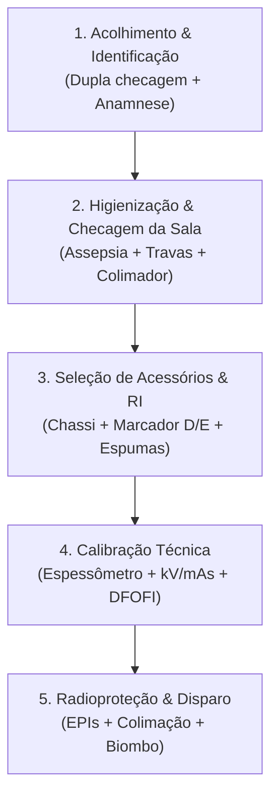

Na metodologia de ensino do **Senac**, o aprendizado não é medido por notas abstratas, mas pelo desenvolvimento comprovado de **competências profissionais**. 

A **UC1 (Preparar equipamentos e acessórios para a realização de exames radiológicos convencionais — 108h)** estabelece a base operacional indispensável para qualquer futuro técnico em radiologia. Antes de posicionar o primeiro paciente, o profissional deve dominar com precisão os 5 critérios de desempenho da unidade.

---

### 📋 Os 5 Critérios de Competência da UC1

---

### 1️⃣ Critério 1: Inspeção e Higienização do Ambiente de Exame

* **Biossegurança e Assepsia**: Desinfecção prévia e pós-exame com álcool 70% nas superfícies de contato (tampo da mesa, estativa vertical e suportes).
* **Checagem Eletromecânica**: Testar os freios e travas mecânicas/eletromagnéticas do tubo, da mesa e do Bucky mural.
* **Sistema Óptico de Colimação**: Acionar o colimador luminoso, verificar o funcionamento da lâmpada, espelho e a coincidência entre o feixe de luz e o campo de raios X.

---

### 2️⃣ Critério 2: Recepção, Acolhimento e Conferência do Paciente

* **Identificação Segura**: Dupla checagem obrigatória (Nome completo e data de nascimento conferidos verbalmente com o pedido médico e o cadastro hospitalar).
* **Anamnese Rápida**: Investigar a queixa principal, capacidade de locomoção, hipótese diagnóstica e eventual estado de gravidez em mulheres em idade fértil (regra dos 10 dias).
* **Preparo Físico**: Orientar a retirada minuciosa de objetos radiopacos da região de interesse (joias, correntes, botões metálicos, zíperes, etc.).

---

### 3️⃣ Critério 3: Seleção e Preparo dos Acessórios e Receptores de Imagem (RI)

* **Formato do Receptor**: Selecionar a dimensão correta de acordo com a estrutura anatômica:
  * **18 × 24 cm** (mão, punho, quirodáctilos).
  * **24 × 30 cm** (antebraço, pé, tornozelo, crânio).
  * **35 × 43 cm** (perna, fêmur, coluna lombar, tórax, abdome, pélvis).
* **Orientação do Chassi/Placa**: Definir posicionamento **longitudinal** ou **transversal**.
* **Identificação Radiopaca**: Posicionar o marcador de lateralidade (**D** para Direito, **E** para Esquerdo) na borda externa do campo luminoso, sem sobreposição às estruturas ósseas (recomendado do lado direito do paciente).
* **Acessórios de Imobilização**: Separar coxins, cunhas de espuma radiotransparentes e faixas de imobilização para conforto e estabilidade do paciente.

---

### 4️⃣ Critério 4: Cálculo e Ajuste dos Fatores Técnicos de Exposição

* **Mensuração Anatômica**: Medir a espessura em centímetros da estrutura a ser radiografada utilizando o **espessômetro**.
* **Uso ou não de Grade Antidifusora (Bucky)**:
  * Estruturas com espessura **< 10 cm** (ex.: mãos, pés): disparo direto na mesa sem grade (reduz a dose de radiação).
  * Estruturas com espessura **≥ 10 cm** (ex.: crânio, coluna, abdome, pelve): uso obrigatório de grade (Bucky) para absorver o espalhamento Compton.
* **Ajuste de Console**: Regular kV, mA, tempo (s), mAs e a Distância Foco-Receptor (**DFOFI**: 100 cm para rotinas gerais ou 180 cm para Tórax).

---

### 5️⃣ Critério 5: Radioproteção e Segurança no Disparo

* **Proteção do Paciente e Acompanhante**: Colocação de protetores de gônadas e aventais de chumbo em acompanhantes indispensáveis e partes do corpo fora do campo de estudo.
* **Colimação Rigorosa**: Fechar as lâminas do colimador estritamente à área de interesse clínico.
* **Execução do Disparo**: Permanecer protegido integralmente atrás do biombo plumbífero durante a emissão do feixe primário, observando o paciente através do visor de vidro plumbífero.

---

### 💡 Resumo do Checklist Operacional

| Etapa | Ação Chave | Verificação Crítica |
| :--- | :--- | :--- |
| **Ambiente** | Assepsia + Travas | Sala limpa e freios travados antes da entrada do paciente. |
| **Acessórios** | Chassi correto + Marcador D/E | Lateralidade identificada e alinhada ao campo. |
| **Console** | kV, mAs e DFOFI | Parâmetros ajustados conforme a medição do espessômetro. |
| **Proteção** | Colimação + Biombo | Feixe colimado e operador 100% protegido no console. |

> 📌 **Conclusão**: O cumprimento metódico desses critérios garante exames de padrão diagnóstico de excelência no primeiro disparo, eliminando repetições e honrando a segurança radiológica do paciente e do operador.
{: .prompt-tip }
