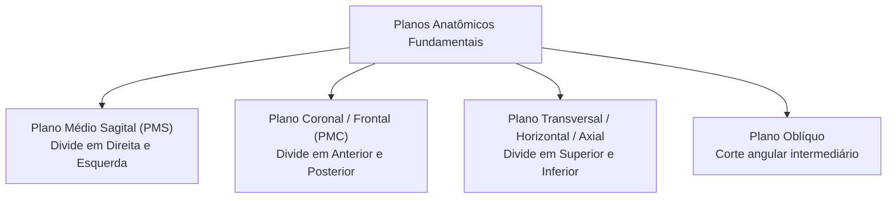
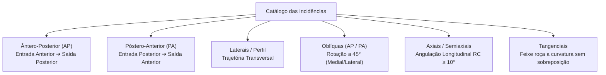
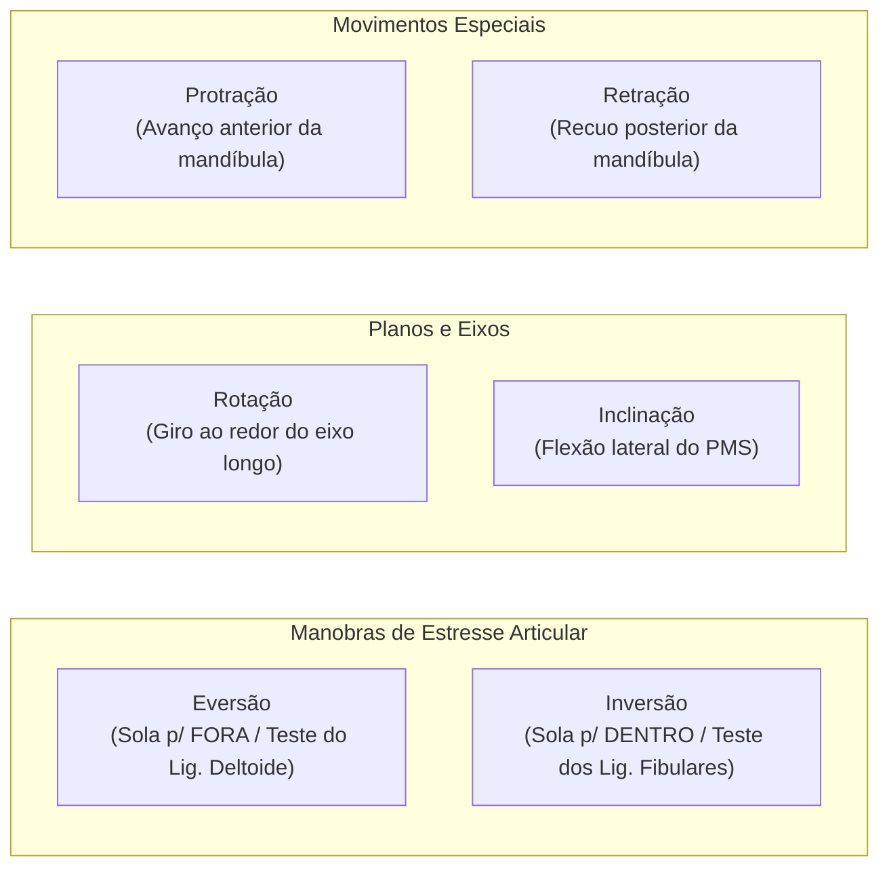

Na radiologia médica e no diagnóstico por imagem, o domínio da **linguagem anatômica padronizada** é essencial para as atividades do técnico em radiologia. Antes de executar qualquer rotina radiográfica, o técnico deve compreender com rigor as relações espaciais entre o **corpo do paciente**, o **raio central (RC)** e o **receptor de imagem (RI)**.

Nesta aula fundamental da **UC1** no Senac, estruturamos o mapa conceitual completo do posicionamento radiográfico moderno.

---

### 1. Posição Anatômica Universal e Planos Corporais

Toda a descrição anatômica, nomenclatura de incidências e trajetórias do feixe parte de uma referencia padrão: a **Posição Anatômica Universal**.

* **Descrição da Postura**: Indivíduo em bipedestação ereta (em pé), com o olhar direcionado horizontalmente para a frente, membros superiores estendidos ao longo do tronco com as **palmas das mãos voltadas para a frente (supinação)** e membros inferiores paralelos com os pés ligeiramente afastados.

#### Os 4 Planos Anatômicos Fundamentais:
1. **Plano Médio Sagital (PMS)**: Plano vertical imaginário longitudinal que divide o corpo exatamente em duas metades simétricas: **direita** e **esquerda**. Planos paralelos ao PMS são denominados **planos parassagitais**.
2. **Plano Coronal (Frontal ou PMC)**: Plano vertical perpendicular ao plano sagital, dividindo o corpo em porções **anterior (ventral)** e **posterior (dorsal)**.
3. **Plano Transversal (Horizontal ou Axial)**: Plano perpendicular tanto ao sagital quanto ao coronal, dividindo o corpo em porções **superior (cranial/cefálica)** e **inferior (caudal/podálica)**.
4. **Plano Oblíquo**: Qualquer plano que passe através do corpo em um ângulo inclinado que não seja paralelo a nenhum dos três eixos ortogonais acima.

---

### 2. Marcos Anatômicos de Superfície (Crânio, Face e Pescoço)

Os **marcos anatômicos de referência** são proeminências ósseas e estruturas cartilaginosas facilmente identificáveis por palpação e inspeção visual. Eles orientam a centralização do Raio Central e o alinhamento das linhas craniométricas fundamentais (como a Linha Orbitomeatal — LOM).

| Marco Anatômico | Descrição Anatômica Precisa | Aplicação Prática na Radiologia |
| :--- | :--- | :--- |
| **Glabela** | Eminência óssea lisa e ligeiramente saliente no osso frontal, localizada entre os arcos superciliares, logo acima da raiz nasal. | Ponto de partida da Linha Glabelomeatal (LGM); referência para centralização em crânio e seios paranasais. |
| **Násio** | Ponto de depressão na raiz do nariz correspondente à sutura frontonasal (junção dos ossos nasais com o osso frontal). | Referência para incidências de ossos próprios do nariz (OPN) e perfil de face. |
| **Acântio** | Ponto central na junção do lábio superior com a base do septo nasal (espinha nasal anterior). | Ponto de emergência do Raio Central na incidência Mento-Naso (Método de Waters) para seios maxilares. |
| **Ponto Mentual (Mênto)** | Ponto mais anterior e inferior no centro da protuberância mentoniana da mandíbula (queixo). | Posicionamento de mandíbula e apoio anterior em exames de face. |
| **Ângulo da Mandíbula (Gônio)** | Vértice póstero-inferior da mandíbula, onde o corpo mandibular se une ao ramo ascendente. | Marca o nível anatômico da 3ª vértebra cervical (C3) e serve de referência para exames cervicais e mandibulares. |
| **Trágus** | Pequena projeção cartilaginosa anterior à abertura do canal auditivo externo. | Ponto de referência para a Linha Infraorbitomeatal (LIOM) e traçado do Plano Horizontal Alemão (Linha de Reid). |
| **Meato Acústico Externo (MAE)** | Orifício de entrada do canal auditivo externo. | Centro de referência para a Linha Orbitomeatal (LOM) e incidências axiais e de perfil de crânio. |
| **Topo da Inserção da Orelha (TEA)** | Ponto superior de fixação da orelha na cabeça. | Corresponde ao nível da fossa craniana média e ao plano superior das órbitas. |

---

### 3. Diferenciação: Incidência (Projeção) vs. Posição

Um dos erros conceituais mais comuns em provas de concursos e na rotina hospitalar é confundir o trajeto do feixe com a postura física do paciente:

* **Posição do Paciente**: Descreve a postura física e o arranjo do corpo do paciente na sala de exame (sobre a mesa ou estativa vertical):
  * **Decúbito Dorsal (Supino)**: Deitado de costas na mesa, com a face anterior voltada para cima.
  * **Decúbito Ventral (Prono)**: Deitado de bruços, com a face anterior apoiada na mesa.
  * **Decúbito Lateral (Direito ou Esquerdo)**: Deitado sobre o lado correspondente do corpo.
  * **Ortopostático (Ortostático / Bipedestação)**: Paciente em pé, ereto.
  * **Sedestação (Posição Sentada)**: Paciente sentado (em cadeira, banqueta ou na própria mesa de exames com tronco ereto a $90^\circ$). Postura padrão para radiografias de extremidades superiores (mão, punho, antebraço, cotovelo) e para pacientes debilitados que não conseguem manter a bipedestação ereta.
  * **Trendelenburg**: Paciente em decúbito dorsal com o plano da mesa inclinado de modo que a cabeça fique mais baixa que os pés.
  * **Fowler**: Paciente semissentado, com a cabeceira da mesa elevada entre $45^\circ$ e $60^\circ$.
  * **Sims (Posição Semiprona)**: Decúbito lateral oblíquo com a perna superior fletida, padrão para introdução de cânulas em exames contrastados (Enema Opaco).

* **Incidência (Projeção Radiográfica)**: É o **vetor do feixe central de raios X (Raio Central — RC)** ao atravessar o corpo humano, do ponto de entrada até o ponto de emergência no receptor de imagem.

> ⚠️ **Regra Fundamental**: Não existe "incidência deitada", mas sim *Incidência Ântero-Posterior (AP) realizada na posição de Decúbito Dorsal*.
{: .prompt-warning }

---

### 4. Classificação Completa das Incidências Radiográficas

#### A. Ântero-Posterior (AP) vs. Póstero-Anterior (PA)

| Incidência | Trajetória do Raio Central | Aplicação e Benefício Clínico |
| :--- | :--- | :--- |
| **Ântero-Posterior (AP)** | O feixe incide na face **anterior** e emerge na face **posterior** do corpo até atingir o receptor. | Padrão para membros inferiores (joelho, fêmur), bacia, abdome em decúbito e coluna vertebral. |
| **Póstero-Anterior (PA)** | O feixe incide no dorso (**face posterior**) e emerge na face **anterior** em contato com o chassi/detector. | Padrão para **Tórax PA** (aproxima a silhueta cardíaca do filme, minimizando a magnificação geométrica) e exames de mão e punho. |

  

    
<strong>Incidência AP (Frente para Trás):</strong>

    
  

  

    
<strong>Incidência PA (Trás para Frente):</strong>

    
  

---

#### B. Incidências Laterais (Perfil)

Na incidência em perfil, o Raio Central atravessa o plano sagital transversalmente em ângulo reto ($90^\circ$ em relação ao plano frontal):
* **Latero-lateral (Direito ou Esquerdo)**: O feixe atravessa o tronco, crânio ou abdome de um lado ao outro (denominado conforme o lado do paciente em contato com o detector — ex.: Tórax em Perfil Esquerdo para manter o ápice cardíaco colado ao filme).
* **Mediolateral**: O Raio Central penetra na face medial (interna) e emerge na face lateral (externa) do membro.
* **Lateromedial**: O Raio Central penetra na face lateral e emerge na face medial (ex.: rotina padrão para o Perfil de Tornozelo e Pé).

---

#### C. Incidências Oblíquas

Uma incidência oblíqua é obtida quando o corpo ou segmento corporal é posicionado em um ângulo intermediário (tipicamente a **$45^\circ$**) entre uma projeção frontal e um perfil:
* **Oblíqua com Rotação Medial (Interna)**: A face anterior da estrutura é girada medialmente em direção ao plano médio sagital do corpo.
* **Oblíqua com Rotação Lateral (Externa)**: A face anterior da estrutura é rodada lateralmente para longe do plano médio sagital (ex.: Mão Oblíqua para visualização individualizada dos metacarpos e falanges).
* **Oblíquas de Tronco**: Denominadas pela superfície e lado mais próximo do receptor:
  * **OAD** (Oblíqua Anterior Direita) e **OAE** (Oblíqua Anterior Esquerda).
  * **OPD** (Oblíqua Posterior Direita) e **OPE** (Oblíqua Posterior Esquerda).

---

#### D. Incidências Axiais e Semiaxiais

Ocorrem quando o **Raio Central é deliberadamente angulado ao longo do eixo longitudinal** da estrutura anatômica (com angulação cefálica ou podálica $\ge 10^\circ$):
* **Axial Superoinferior**: Muito empregada em articulações escapuloumerais e estudos axilares do ombro.
* **AP Axial de Crânio (Método de Towne)**: O feixe central é angulado a $30^\circ$ caudal (em relação à LOM) ou $37^\circ$ caudal (em relação à LIOM) para desobstruir e projetar o forame magno e os ossos occipitais.
* **Axial de Patela (Método de Settegast/Hughston)**: Feixe angulado através do sulco intercondilar para avaliação do espaço femoropatelar.

---

#### E. Incidências Tangenciais

O Raio Central "roça" ou "toca" a superfície de uma estrutura curva sem atravessar a massa densa do restante do órgão. É a técnica de escolha para demonstrar fraturas com afundamento do arco zigomático, osso nasal ou lesões superficiais de costelas.

---

### 5. Movimentos Articulares e Mecânica de Posicionamento

O posicionamento radiográfico exige orientações cinéticas precisas para manobras de rotina e avaliações de estresse ligamentar:

#### A. Rotação vs. Inclinação
* **Rotação**: Ato de girar ou rodar a estrutura corporal ou a cabeça ao redor do seu próprio eixo longitudinal.
* **Inclinação**: Movimento de flexão lateral onde o Plano Médio Sagital (PMS) é inclinado em relação à linha vertical ou horizontal de suporte.

---

#### B. Eversão vs. Inversão (Manobras de Estresse no Tornozelo)
* **Eversão (Movimento em Valgo)**: A sola do pé (superfície plantar) é voltada e forçada para fora (direção lateral), abrindo a interlinha articular medial e testando a integridade do **ligamento deltoide**.
* **Inversão (Movimento em Varo)**: A sola do pé é voltada e forçada para dentro (direção medial), abrindo o compartimento articular lateral e avaliando os **ligamentos fibulotalares anterior/posterior e fibulocalcâneo**.

---

#### C. Protração vs. Retração
* **Protração**: Movimento linear de projeção anterior de uma estrutura (ex.: empurrar a mandíbula para a frente).
* **Retração**: Movimento de retorno ou deslocamento posterior da estrutura anatômica para sua posição basal.

---

#### D. Pronação vs. Supinação
* **Supinação**: Posição anatômica do antebraço onde a palma da mão está voltada para a frente (ou para cima), mantendo rádio e ulna paralelos sem sobreposição.
* **Pronação**: Rotação medial do antebraço de modo que a palma da mão fique voltada para trás (ou para baixo), cruzando o rádio sobre a ulna no terço proximal.

---

### 6. As Regras de Ouro do Posicionamento Radiográfico (Bontrager)

Para que um exame tenha valor médico legal e clínico indiscutível, aplicamos três princípios fundamentais da literatura clássica:

1. **Princípio das Duas Incidências Ortogonais a $90^\circ$**:
   * Uma única projeção bidimensional projeta estruturas sobrepostas e esconde fraturas alinhadas ao plano do feixe. Todo estudo radiográfico de rotina exige **no mínimo duas projeções em ângulos retos entre si (geralmente uma frontal AP/PA e um Perfil)**.
2. **Princípio das Duas Articulações em Ossos Longos**:
   * Toda radiografia de ossos longos (antebraço, braço, perna, fêmur) deve **incluir obrigatoriamente as articulações proximal e distal** no mesmo filme ou receptor, evitando que luxações ou fraturas indiretas passem despercebidas (ex.: Fratura de Monteggia ou Galeazzi).
3. **Identificação Radiopaca Inquestionável**:
   * O marcador de lateralidade (**D** para Direito ou **E** para Esquerdo) deve ser colocado na borda do campo colimado, no lado anatômico correto do paciente, sem sobrepor tecido ósseo ou áreas de interesse.

> 💡 **Conclusão**: Dominar a terminologia anatômica, a geometria do feixe e a mecânica do posicionamento é o que garante imagens diagnósticas no primeiro disparo — reduzindo repetições e aplicando com perfeição o princípio **ALARA**.
{: .prompt-tip }
