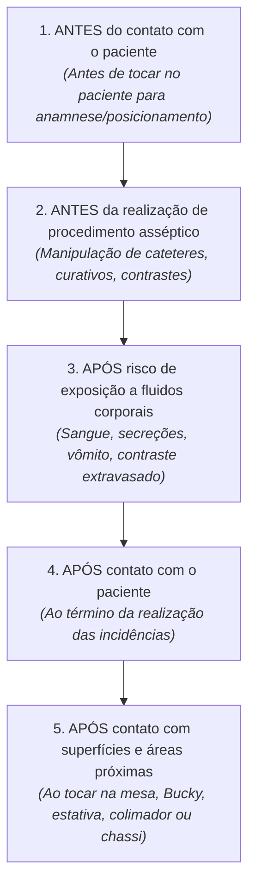
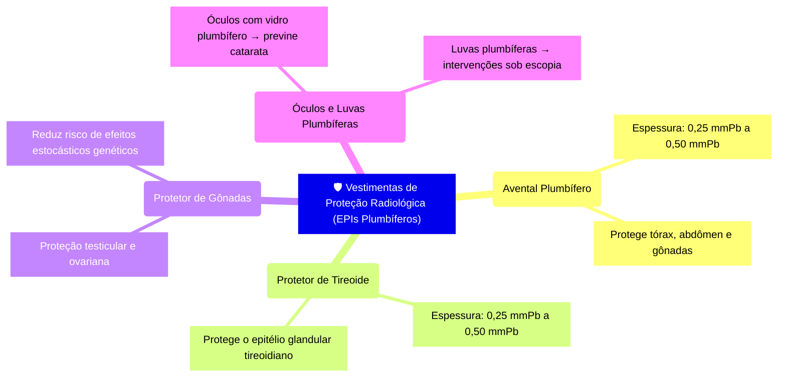

No imaginário popular, o maior risco existente dentro de uma sala de raios X é a radiação ionizante. No entanto, na prática diária hospitalar e ambulatorial, o profissional das técnicas radiológicas convive com uma **dupla frente de risco**: o risco **físico** (da radiação) e o risco **biológico** (da contaminação cruzada por vírus, bactérias multirresistentes e fluidos corporais).

Na **aula do dia 12 de maio de 2026 da UC1**, mergulhamos nos protocolos de biossegurança que transformam a teoria das normas regulamentadoras em procedimentos automáticos e salvaguardas de vida na rotina de exames.

---

## 1. A Higienização das Mãos: A Barreira Nº 1 Contra a Contaminação Cruzada

As mãos do profissional de saúde são o principal veículo de transmissão de microrganismos em ambiente hospitalar. No setor de radiodiagnóstico, o técnico manipula constantemente o paciente, posiciona partes anatômicas diretamente em contato com a pele, ajusta a mesa de exames, o colimador e depois opera o teclado do console de comando.

Sem a higienização correta, o chassi radiográfico ou o comando do aparelho tornam-se vetores imediatos de infecção entre dezenas de pacientes atendidos no mesmo plantão.

---

### Os 5 Momentos Essenciais da Higienização das Mãos (OMS / ANVISA)

A **ANVISA** e a **Organização Mundial da Saúde (OMS)** preconizam 5 momentos obrigatórios para a higienização das mãos no fluxo de atendimento ao paciente:

---

### Higienização Simples com Água e Sabonete vs. Fricção Antisséptica com Álcool a 70%

| Critério | Água e Sabonete Líquido | Fricção Antisséptica com Álcool 70% (Gel ou Líquido) |
| :--- | :--- | :--- |
| **Quando usar?** | Sempre que as mãos estiverem **visivelmente sujas**, com resíduos ou após contato com fluidos corporais. | Quando as mãos **não apresentarem sujidade visível** (entre etapas de posicionamento e após tocar em superfícies limpas). |
| **Duração do Processo** | **40 a 60 segundos** | **20 a 30 segundos** |
| **Efeito Mecânico** | Remove sujidades mecânicas, oleosidade e a microbiota transitória por arraste. | Promove a inativação/destruição imediata da membrana celular de bactérias e vírus envelopados. |

---

### O Protocolo dos 11 Passos da Lavagem das Mãos (Técnica ANVISA/OMS)

*Figura 1: Sequência ilustrada do protocolo oficial de higienização das mãos com água e sabonete em 11 passos (Diretrizes ANVISA/OMS).*

1. **Abrir a torneira** e molhar as mãos com água corrente (sem encostar na pia).
2. **Aplicar sabonete líquido** suficiente para cobrir toda a superfície das mãos.
3. **Friccionar as palmas** das mãos entre si em movimentos circulares.
4. **Friccionar o dorso da mão esquerda** com a palma da mão direita, entrelaçando os dedos, e vice-versa.
5. **Entrelaçar os dedos** palma com palma, friccionando os espaços interdigitais.
6. **Friccionar o dorso dos dedos** de uma mão contra a palma da mão oposta, segurando os dedos em concha (movimento de vai-e-vem).
7. **Friccionar o polegar esquerdo** em movimento circular com a palma da mão direita, e vice-versa.
8. **Friccionar as polpas digitais e unhas** da mão direita contra a palma da mão esquerda em movimentos circulares, e vice-versa.
9. **Friccionar os punhos** em movimentos rotativos com a mão oposta.
10. **Enxaguar abundantemente** as mãos no sentido das pontas dos dedos para os punhos, sem esfregar as mãos sob a água.
11. **Secar com papel-toalha descartável** (usando a primeira folha para as mãos e a última para fechar a torneira, caso o acionamento não seja automático ou por pedal).

*Figura 2: Demonstração prática em laboratório com teste de pigmento para evidenciar a importância da fricção minuciosa em todas as regiões anatômicas (palmas, dorsos, espaços interdigitais e punhos).*

---

## 2. A Norma Regulamentadora nº 32 (NR-32) na Radiologia

A **NR-32 (Segurança e Saúde no Trabalho em Serviços de Saúde)**, emitida pelo Ministério do Trabalho e Emprego (MTE), possui força de lei e estabelece diretrizes intransponíveis para a segurança dos trabalhadores da saúde:

*Figura 3: Projeção em aula ressaltando o uso obrigatório de jaleco manga longa, calçados fechados, crachá/dosímetro e política rigorosa de adorno zero.*

### 🚫 A Regra do "Adorno Zero"
É terminantemente proibido o uso de qualquer adorno no ambiente de trabalho:
* **Vedados:** Anéis, alianças, pulseiras, relógios de pulso, colares, brincos compridos e *piercings* visíveis.
* **Por quê?** Adornos acumulam microrganismos nos sulcos e fendas que não são eliminados na lavagem das mãos, rasgam luvas cirúrgicas e de procedimento e podem gerar artefatos metálicos radiopacos indesejados nas radiografias caso o profissional precise conter o paciente.

### 👟 Calçados, Cabelos e Vestimenta
* **Calçados:** Obrigatoriamente **fechados** (cabedal de material impermeável e solado antiderrapante). É proibido o uso de tamancos abertos, chinelos ou calçados de tecido permeável.
* **Cabelos e Barba:** Cabelos longos devem permanecer **presos** e contidos (touca descartável quando necessário).
* **Unhas:** Devem ser mantidas **curtas e limpas**, evitando unhas postiças/gel que facilitam a proliferação fúngica e bacteriana.
* **Alimentação:** É proibido consumir ou guardar qualquer tipo de alimento, bebida ou medicamento nos postos de comando e salas de raio-X.

### 🧤 Uso Consciente de Luvas de Procedimento
> ⚠️ **Atenção Técnica:** As luvas de procedimento descartáveis são uma barreira de proteção individual e **NUNCA substituem a higienização das mãos**. As mãos devem ser higienizadas imediatamente antes de calçar as luvas e imediatamente após a sua retirada e descarte em lixo infectante (saco branco leitoso).

---

## 3. Equipamentos de Proteção Individual (EPIs) Plumbíferos

Além dos EPIs biológicos convencionais (máscara cirúrgica/N95, luvas e óculos de proteção), a radiologia exige a paramentação plumbífera para conter a radiação secundária (radiação espalhada por Efeito Compton):

*Figura 4: Armazenamento correto de vestimentas plumbíferas suspensas em suporte específico, acompanhadas de protetor de tireoide e dosímetro pessoal (TLD/OSL).*

---

### 🛑 O Mandamento Sagrado: Avental de Chumbo NUNCA Deve Ser Dobrado!

A regra mais repetida em qualquer serviço sério de diagnóstico por imagem é clara: **o avental de chumbo jamais deve ser dobrado ou jogado sobre macas e mesas**.

* **O que acontece ao dobrar?** O interior do avental é composto por lâminas de borracha plumbífera flexível. Ao dobrar o avental, a dobra cria uma tensão mecânica que **rompe e fragmenta o chumbo internamente**, abrindo fendas e trincas microscópicas.
* **O perigo invisível:** O tecido externo do avental permanece intacto e bonito, mas o profissional ou acompanhante que o veste recebe radiação direta vazando pelas fissuras internas do chumbo.
* **Armazenamento Correto:** Os aventais e protetores de tireoide devem ser armazenados **sempre suspensos em cabides próprios de aço** ou estendidos em suportes murais específicos.
* **Higienização do Avental:** Deve ser feita com pano macio umedecido em água e sabão neutro ou álcool a 70%, sem encharcar nem submergir a peça em água.

---

## 4. Assepsia e Desinfecção de Receptores de Imagem e Mobiliário

Entre a realização de um exame e outro, a sala de raios X deve passar pela desinfecção de contato:

1. **Chassis Radiográficos, Placas de CR (PSP) e Detectores Digitais (DR):**
   * Devem ser limpos com pano de microfibra umedecido com álcool a 70% ou álcool isopropílico.
   * **Nunca borrifar líquidos diretamente sobre os cassetes ou detectores DR**, pois o líquido pode penetrar pelas vedações e queimar os circuitos eletrônicos internos de cintilação (CsI/TFT).
2. **Mesa de Exames e Bucky Mural:**
   * Limpeza de toda a extensão do tampo da mesa e da estativa vertical com desinfetante hospitalar padronizado (quaternário de amônio ou álcool 70%).
   * Troca obrigatória do lençol descartável de papel entre cada paciente atendido.
3. **Colimador e Alças de Movimentação do Tubo:**
   * Desinfecção periódica dos manípulos e travas onde as mãos do operador têm contato contínuo durante o alinhamento do feixe.

---

## 📋 Checklist Prático de Biossegurança no Plantão

| Etapa | Ação Obrigatória do Técnico | Base Legal |
| :---: | :--- | :---: |
| **Antes do Atendimento** | Retirar adornos, prender cabelos, conferir calçado fechado e lavar as mãos. | NR-32 |
| **Preparo da Sala** | Desinfetar tampo da mesa, estativa vertical e colocar papel descartável novo. | ANVISA / RDC 50 |
| **Preparo dos EPIs** | Inspecionar visualmente aventais plumbíferos nos cabides e separar protetor de tireoide. | CNEN NN 3.01 |
| **Durante o Atendimento** | Higienizar as mãos / aplicar álcool 70% antes do toque e após posicionar o paciente. | Protocolo OMS |
| **Após o Atendimento** | Descartar lençol de papel, desinfetar superfícies e receptor de imagem com álcool 70%. | ANVISA |
| **Fim do Plantão** | Guardar todos os aventais estendidos nos suportes murais e higienizar o console de comando. | NR-32 / CQ |

---

## 💡 Conclusão

A técnica radiográfica perfeita — com o kV ideal, o mAs preciso e o posicionamento impecável — não tem qualquer valor terapêutico se o exame transmitir uma infecção hospitalar ao paciente ou expuser o profissional a contaminações evitáveis.

Ser um Técnico em Radiologia de destaque exige **disciplina cirúrgica na biossegurança**: lavar as mãos com técnica impecável, cumprir a NR-32 sem concessões e cuidar dos equipamentos de proteção com o máximo zelo profissional.

---

### 📚 Referências Bibliográficas e Normativas

1. **BRASIL. Ministério do Trabalho e Emprego.** *Norma Regulamentadora nº 32 (NR-32): Segurança e Saúde no Trabalho em Serviços de Saúde*. Brasília: MTE, 2005.
2. **AGÊNCIA NACIONAL DE VIGILÂNCIA SANITÁRIA (ANVISA).** *Segurança do Paciente em Serviços de Saúde: Higienização das Mãos*. Brasília: ANVISA, 2009.
3. **ORGANIZAÇÃO MUNDIAL DA SAÚDE (OMS).** *Manual para Observadores: Estratégia Multimodal da OMS para a Melhoria da Higienização das Mãos*. Genebra: OMS, 2009.
4. **COMISSÃO NACIONAL DE ENERGIA NUCLEAR (CNEN).** *Diretrizes Básicas de Proteção Radiológica (CNEN NN 3.01)*. Rio de Janeiro: CNEN, 2014.
5. **BONTRAGER, Kenneth L.; LAMPIGNANO, John P.** *Tratado de Posicionamento Radiográfico e Anatomia Associada*. 8. ed. Rio de Janeiro: Elsevier, 2015.

