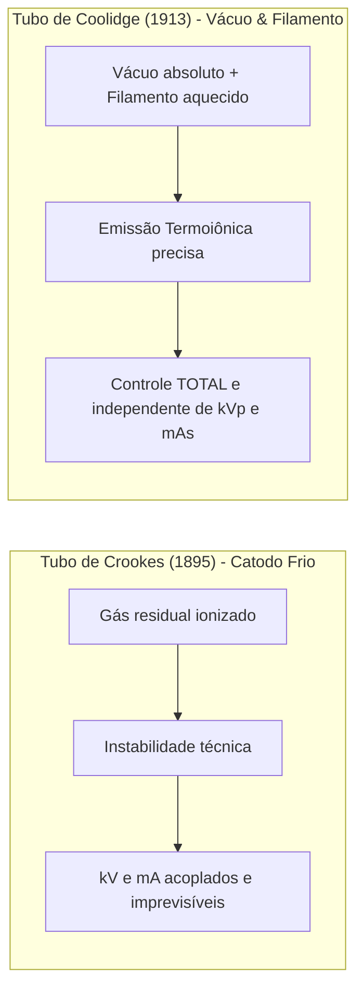
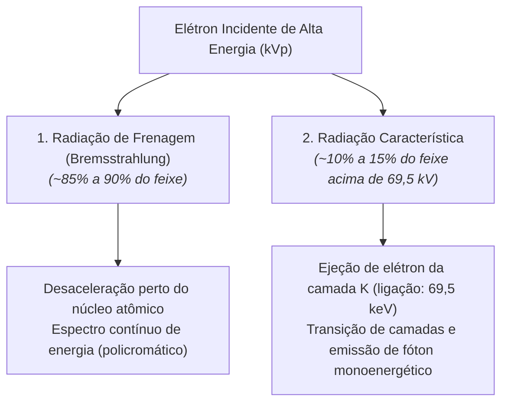
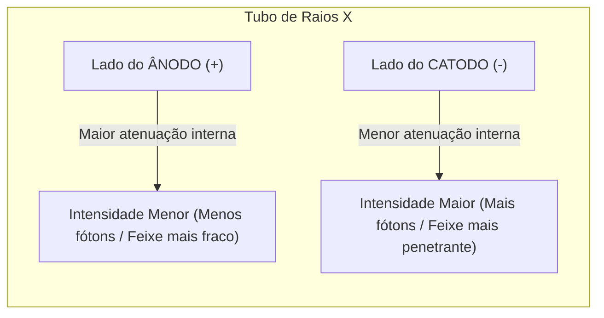

Em 1895, Wilhelm Röntgen descobriu os raios X utilizando um tubo de gás de Crookes — um equipamento instável, com baixa reprodutibilidade e no qual a quantidade de radiação gerada dependia da quantidade residual de gás no interior da ampola. 

A grande revolução que transformou a radiologia diagnóstica em uma ciência médica precisa ocorreu em **1913**, quando o físico norte-americano **William David Coolidge** desenvolveu o **tubo termoiônico a vácuo (Tubo de Coolidge)**. 

Na **aula do dia 13 de maio de 2026 da UC1**, estudamos a fundo a anatomia, a termodinâmica e os fenômenos quânticos que ocorrem no milissegundo em que o técnico pressiona o disparador no console de comando.

---

## 1. A Revolução do Tubo de Coolidge: Controle Independente de $kV$ e $mA$

A genialidade de William Coolidge consistiu em duas modificações fundamentais:
1. **Vácuo de Alto Grau ($10^{-6}\text{ a }10^{-7}\text{ mmHg}$)** dentro de um invólucro de vidro borossilicato (*Pyrex*) termorresistente, eliminando os gases residuais.
2. **Substituição do catodo frio por um filamento de Tungstênio espiralado**, aquecido por uma corrente elétrica de baixa tensão para liberar elétrons livres por **Emissão Termoiônica**.



Graças a isso, o operador pode controlar:
* **A Quantidade de Elétrons ($mAs$):** Ajustando a corrente que aquece o filamento ($mA$) e o tempo de disparo ($s$).
* **A Energia Cinética / Poder de Penetração dos Elétrons ($kVp$):** Ajustando a diferença de potencial elétrico entre o catodo e o anodo.

---

## 2. Anatomia Interna do Tubo de Raios X

O tubo de raios X opera como um diodo de alta potência dentro de uma carcaça de proteção plumbífera preenchida com óleo isolante e refrigerante:

```mermaid
flowchart TD
    subgraph Ampola["Ampola de Raios X (Invólucro a Vácuo)"]
        subgraph Catodo["1. CATODO (-) Pólo Negativo"]
            F1["Filamento Fino (Pequeno Foco)"]
            F2["Filamento Grosso (Grande Foco)"]
            F3["Capa Focalizadora de Molibdênio"]
        end

        subgraph Anodo["2. ÂNODO (+) Pólo Positivo"]
            A1["Disco de Tungstênio / Rênio"]
            A2["Haste de Molibdênio"]
            A3["Rotor e Estator (Motor de Indução)"]
        end

        Catodo -->|Nuvem de Elétrons acelerados por DDP (kV)| Anodo
        Anodo -->|99% Calor + 1% Raios X| Janela["Janela de Saída do Feixe Útil"]
    end
```

---

### A. O Catodo (Pólo Negativo — A Fonte de Elétrons)
* **Filamentos de Tungstênio (W):** O tungstênio é escolhido por seu **elevadíssimo ponto de fusão (3.422 °C)** e por não evaporar facilmente sob calor intenso.
* **Capa Focalizadora (*Focusing Cup*):** Estrutura de molibdênio ou níquel com carga negativa que envolve os filamentos. Sua função eletrostática é **confinar e direcionar a nuvem de elétrons** (efeito de carga espacial) para que colidam em uma área minúscula e precisa do ânodo chamada **Ponto Focal**.
* **Duplo Filamento (Foco Fino vs. Foco Grosso):**
  * **Foco Fino ($0,6\text{ mm}$):** Utiliza correntes baixas ($\le 100\text{ mA}$). Produz máxima resolução espacial e detalhe anatômico (ideal para extremidades: mão, punho, dedos, antebraço).
  * **Foco Grosso ($1,2\text{ mm}$):** Suporta altas correntes ($\ge 200\text{ a }500\text{ mA}$). Dissipa maior carga térmica sem fundir o ânodo (ideal para estruturas espessas: tórax, abdômen, pelve, coluna e crânio).

---

### B. O Ânodo (Pólo Positivo — O Alvo da Colisão)
* **Ânodo Fixo:** Utilizado apenas em aparelhos de baixíssima potência (como odontológicos intraorais e equipamentos portáteis muito antigos).
* **Ânodo Giratório:** Um disco chanfrado que gira em altas velocidades (**3.000 a 10.000 RPM**) acionado por um motor de indução eletromagnética externo (estator).
  * **Vantagem térmica:** A rotação faz com que o feixe de elétrons atinja uma **pista focal circular contínua**, multiplicando por centenas de vezes a área de dissipação de calor em comparação ao ânodo fixo.
  * **Composição da Pista Focal:** Liga de **90% Tungstênio ($Z=74$)** e **10% Rênio ($Z=75$)** com base de molibdênio e grafite para alívio de peso e condutividade térmica.

---

## 3. O Rendimento Energético: O Grande Desafio da Termodinâmica

Quando os elétrons acelerados colidem contra a pista de tungstênio do ânodo a velocidades de até metade da velocidade da luz, a conversão energética é drasticamente assimétrica:

$$\text{Energia Cinética Total} = \mathbf{99\% \text{ Calor (Agitação Térmica)}} + \mathbf{1\% \text{ Fótons de Raios X}}$$

Mais de **99% da energia cinética dos elétrons transforma-se em calor instantâneo** por colisões elásticas com as camadas eletrônicas externas dos átomos de tungstênio. Apenas **menos de 1%** resulta na produção real de fótons de raios X úteis para o diagnóstico.

Por esse motivo, o tubo é imerso em **óleo mineral de alta rigidez dielétrica**, que dissipa o calor por convecção e isola os componentes contra arcos elétricos de alta voltagem ($> 100.000\text{ V}$).

---

## 4. Como os Raios X São Produzidos: Os 2 Mecanismos Físicos

Ao colidirem com o alvo de tungstênio, os elétrons incidentes produzem dois tipos distintos de radiação no espectro de emissão:



---

### A. Radiação de Frenagem (*Bremsstrahlung*)
* Ocorre quando um elétron incidente de alta velocidade passa próximo ao campo elétrico positivo do **núcleo atômico de tungstênio**.
* O elétron é atraído pelo núcleo, perde velocidade (é "freado") e sofre deflexão de sua trajetória original.
* A energia cinética perdida na frenagem é instantaneamente emitida sob a forma de um **fóton de raio X**.
* **Resultado:** Um **espectro contínuo** de energia (policromático), variando desde fótons de baixa energia até o valor máximo estabelecido pelo $kVp$ selecionado no comando.

---

### B. Radiação Característica
* Ocorre quando o elétron incidente colide diretamente e **ejeta um elétron orbital da camada mais interna ($K$)** do átomo de tungstênio.
* Para ejetar o elétron da camada $K$ do tungstênio, a energia do elétron incidente deve ser **superior à sua energia de ligação ($69,5\text{ keV}$)**.
* Ao abrir-se uma vacância na camada $K$, um elétron de uma camada mais externa ($L$ ou $M$) salta imediatamente para preencher o vazio.
* A diferença exata entre os níveis de energia das duas camadas orbitais é emitida como um fóton de raio X com **energia discreta e característica do elemento químico** (ex: transição $L \to K = 69,5 - 12,1 = 57,4\text{ keV}$).
* Abaixo de **$70\text{ kVp}$**, **não existe produção de radiação característica** em tubos com anodo de tungstênio.

---

## 5. O Efeito Anódico (Efeito Heel): Aplicação Prática no Posicionamento

Devido ao ângulo de inclinação do ânodo (7° a 20°) e ao fato de os raios X serem produzidos alguns micrômetros dentro da estrutura do alvo, os fótons que saem em direção ao lado do ânodo precisam atravessar uma espessura maior de material do próprio disco metálico, sofrendo **autoatenuação**.




*Figura 1: Anatomia interna do tubo de raios X com ânodo giratório e gradiente de intensidade do feixe pelo Efeito Anódico.*

### 💡 A Regra de Ouro do Efeito Heel para o Técnico:

> **"A parte mais espessa e densa da anatomia do paciente deve ser posicionada SEMPRE voltada para o lado do CATODO (-)."**

### Exemplos Práticos de Aplicação Clínica:
1. **Fêmur (AP / Perfil):** O quadril/região proximal (mais espessa) fica voltada para o **Catodo**, e o joelho (mais fino) para o **Ânodo**.
2. **Pé (AP):** O retropé/tornozelo fica voltado para o **Catodo**, e a ponta dos dedos/antepé para o **Ânodo**.
3. **Coluna Torácica:** A porção inferior (mais densa) fica voltada para o **Catodo**, e a porção superior (mais estreita) para o **Ânodo**.
4. **Mamografia:** O tubo é projetado especialmente para que o lado do **Catodo** fique posicionado contra a parede torácica (base da mama, mais espessa) e o **Ânodo** voltado para a região do mamilo.

---

## 📋 Resumo Consolidado dos Parâmetros

| Conceito | Componente Físico | O que controla na imagem? |
| :--- | :--- | :--- |
| **Emissão Termoiônica** | Filamento de Tungstênio no Catodo | O número de elétrons livres (controlado pelo $mA$). |
| **Alta Voltagem ($kVp$)** | Diferença de Potencial Catodo-Ânodo | A energia cinética dos elétrons e o poder de penetração/contraste do feixe. |
| **Ponto Focal Fino** | Filamento menor ($0,6\text{ mm}$) | Máxima nitidez e resolução espacial em estruturas finas. |
| **Ponto Focal Grosso** | Filamento maior ($1,2\text{ mm}$) | Alta tolerância térmica para estruturas densas e volumosas. |
| **Efeito Anódico (Heel)** | Geometria e inclinação do disco do Ânodo | Variação de intensidade do feixe (Catodo = Forte / Ânodo = Fraco). |

---

## 💡 Conclusão

Compreender a física do tubo de Coolidge liberta o técnico da dependência cega de "tabelinhas pré-programadas". Ao entender a termodinâmica do ânodo, o limite dos pontos focais e o comportamento da radiação de frenagem e do efeito Heel, o profissional passa a operar a máquina com **domínio técnico absoluto, garantindo excelência diagnóstica com a menor dose possível**.

---

### 📚 Referências Bibliográficas

1. **BUSHONG, Stewart C.** *Ciência Radiológica para Tecnólogos: Física, Biologia e Proteção*. 10. ed. Rio de Janeiro: Elsevier, 2017.
2. **BONTRAGER, Kenneth L.; LAMPIGNANO, John P.** *Tratado de Posicionamento Radiográfico e Anatomia Associada*. 8. ed. Rio de Janeiro: Elsevier, 2015.
3. **BIASOLI, Nair Schiavon.** *Radiologia — Técnicas Radiográficas*. 5. ed. São Paulo: Santos, 2009.
4. **SCAFF, Luiz Antonio Medeiros.** *Física da Radioterapia e do Radiodiagnóstico*. São Paulo: Sarvier, 1997.

