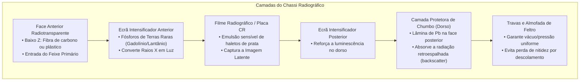
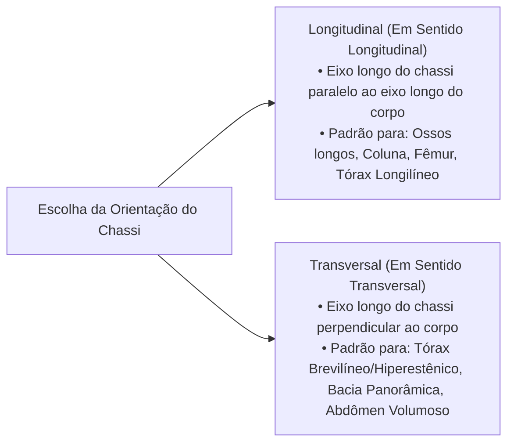
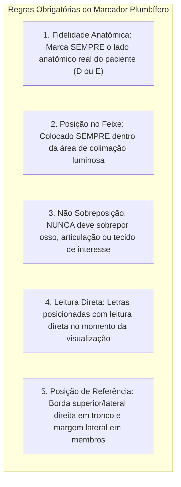

O sucesso de um exame radiológico não depende exclusivamente da escolha matemática dos kilovolts (kV) e miliamperes-segundo (mAs). Antes mesmo de energizar o painel de comando, o técnico em radiologia toma uma série de decisões físicas cruciais: a seleção do formato adequado do **chassi radiográfico (cassete)**, a orientação espacial do filme/detector, a fixação correta do **identificador plumbífero** e o acoplamento seguro na **gaveta Bucky**.

Na **aula prática da UC1** no laboratório de radiologia do Senac, realizamos um treinamento intensivo de bancada e sala de exames dedicado ao reconhecimento, manuseio e padronização de todos os acessórios operacionais da radiologia médica.

*Formatos padronizados de chassis radiográficos (13x18 a 35x43 cm) utilizados no laboratório de práticas radiológicas.*

---

## 📦 1. Anatomia e Física do Chassi Radiográfico (Cassete)

O **chassi radiográfico** é um invólucro rígido, estanque à luz visível, projetado para acomodar o receptor de imagem (filme radiográfico convencional ou placa de fósforo fotoestimulável — CR) mantendo-o em contato íntimo e uniforme com as telas intensificadoras (*ecrãs*).

### Principais Componentes Estruturais:
1. **Face Anterior (Lado de Exposição)**: Confeccionada com materiais de baixo número atômico ($Z$), como fibra de carbono, magnésio ou plástico especial. Permite a penetração máxima do feixe de raios X com mínima atenuação.
2. **Ecrãs Intensificadores (*Screens*)**: Telas recobertas por fósforos de terras raras (Oxissulfeto de Gadolínio dopado com Térbio ou Oxibrometo de Lantânio). Quando atingidos por um único fóton de raios X, emitem milhares de fótons de luz visível (verde ou azul), sensibilizando o filme:
   * **Benefício Biológico**: Reduz em mais de 95% a dose de radiação necessária no paciente em comparação à exposição direta do filme (aplicação direta do Princípio ALARA).
3. **Lâmina Plumbífera Posterior**: Uma fina folha de chumbo instalada na face de fechamento traseira. Sua função é absorver a **radiação retroespalhada (*backscatter*)** proveniente da mesa ou da parede, impedindo que ela retorne e vele o filme pelo verso.
4. **Almofada de Pressão e Travas**: Camada de feltro ou espuma de alta densidade que comprime o filme uniformemente contra os ecrãs ao travar o chassi, eliminando bolsas de ar que causariam borramento localizado da imagem.

---

## 📐 2. Tabela de Formatos Padronizados de Chassis e Aplicações Clínicas

Na rotina clínica hospitalar, a escolha do tamanho do chassi é regida pela regra de **abrangência anatômica estrita com menor área de exposição desnecessária**:

| Formato Nominal (cm) | Equivalente em Polegadas | Indicação Anatômica e Aplicações Clínicas Típicas |
| :---: | :---: | :--- |
| **13 × 18 cm** | 5 × 7" | Quirodáctilos (dedos da mão) isolados, pododáctilos (dedos do pé), articulações interfalangianas, exames pediátricos de neonatologia e estruturas faciais focalizadas (ex: OPN com colimação). |
| **18 × 24 cm** | 8 × 10" | Mão (PA, Oblíqua, Perfil), Punho (PA, Perfil, Série de Escafoide), Antepé, Calcâneo (Axial/Perfil), Articulação Temporomandibular (ATM) e Seios da Face pediátricos. |
| **24 × 30 cm** | 10 × 12" | Crânio (AP, Perfil, Towne), Seios Paranasais (Waters, Caldwell), Coluna Cervical, Clavícula, Escápula, Cotovelo, Antebraço adulto, Pé e Tornozelo. |
| **30 × 40 cm** | 12 × 15" | Perna (Tíbia e Fíbula incluindo joelho e tornozelo), Úmero (incluindo ombro e cotovelo), Coluna Torácica, Coluna Lombar e Bacia infantil/adolescente. |
| **35 × 43 cm** | 14 × 17" | **Tórax Adulto** (PA e Perfil), **Abdômen Simples** (AP em decúbito ou ortostase), **Bacia / Pelve Adulta** (AP panorâmica), **Fêmur Adulto** (posicionado em diagonal) e estudos de **Escanometria**. |

*Posicionamento de identificadores de chumbo e verificação do alinhamento central na gaveta Bucky.*

---

## 🔄 3. Orientação Espacial do Chassi: Longitudinal vs. Transversal

Ao posicionar o chassi na mesa ou estativa vertical, o técnico define sua orientação em relação ao eixo maior do corpo do paciente:

* **Chassi em Sentido Longitudinal**: O comprimento do chassi acompanha o comprimento longitudinal da estrutura anatômica. É a orientação obrigatória para radiografias de ossos longos (antebraço, braço, perna, fêmur), coluna vertebral e tórax de pacientes longilíneos (astênicos/hipoestênicos).
* **Chassi em Sentido Transversal**: A largura do chassi é colocada transversalmente. Padrão obrigatório para radiografia de **Bacia Panorâmica** (para incluir as duas articulações coxofemorais e as cristas ilíacas) e radiografia de **Tórax de pacientes brevilíneos (hiperestênicos)**, cujos campos pulmonares são mais largos e curtos, evitando o corte dos seios costofrênicos laterais.

---

## 🏷️ 4. As Regras de Ouro do Identificador Plumbífero (Marcador D / E)

O identificador radiopaco de chumbo não é um mero detalhe estético — ele é um **documento médico-legal obrigatório**. A inversão ou ausência da identificação de lateralidade pode induzir a erros cirúrgicos graves (como amputações ou intervenções no lado errado do paciente).

### Diretrizes Práticas de Laboratório:
1. **Regra de Ouro da Lateralidade**: O marcador indica o **lado anatômico do paciente**, e nunca a mão dominante do técnico ou a orientação da sala.
2. **Posição nos Exames de Tronco (Tórax e Abdômen)**:
   * Em projeções frontais (**PA de Tórax** ou **AP de Abdômen**), o identificador deve ser colocado na **borda superior ou inferior do lado direito anatômico do paciente**, fora do campo pulmonar e das cúpulas diafragmáticas.
3. **Posição nos Exames de Extremidades (Membros)**:
   * O identificador deve ser fixado na **margem lateral** do membro examinado (ex: borda lateral do antebraço ou pé), indicando com clareza se trata-se do membro Direito (**D**) ou Esquerdo (**E**).
4. **Incidências em Decúbito Lateral com Raio Horizontal (Método de Laurel)**:
   * Identificar expressamente o lado que está voltado para cima ou o lado que está em apoio sobre a mesa.
5. **Proibições Absolutas**:
   * Nunca posicionar o marcador sobre áreas de suspeita de fratura ou patologia.
   * Nunca realizar identificação eletrônica posterior ("chumbinho digital") como substituto padrão da identificação física com marcadores de chumbo durante a exposição, exceto em detectores digitais diretos com validação rígida de protocolo.

---

## 🗄️ 5. A Gaveta Bucky: Centralização, Travamento e Grade Antidifusora

A gaveta Bucky (presente tanto na mesa horizontal quanto na estativa vertical / Bucky mural) aloja o chassi sob uma **grade antidifusora móvel (Potter-Bucky)**.

*Alinhamento da estativa vertical e ajuste de centralização do feixe central com a gaveta Bucky.*

### Passo a Passo Operacional no Laboratório:
1. **Destravamento e Abertura**: Puxar a gaveta Bucky suavemente até o batente final.
2. **Abertura das Garras Autocentralizadoras**: Abrir as presilhas laterais e superior/inferior da bandeja.
3. **Inserção e Centralização do Chassi**: Encaixar o chassi no centro exato da bandeja, alinhando a linha de centro gravada no chassi com o entalhe central da gaveta.
4. **Fechamento e Travamento das Garras**: Soltar as garras para que elas travem o chassi de forma firme e perfeitamente simétrica.
5. **Fechamento da Gaveta**: Empurrar a gaveta Bucky para dentro da mesa/estativa até ouvir o clique de travamento magnético/mecânico.
6. **Alinhamento do Tubo com a Gaveta**: Travar a centralização longitudinal e transversal do tubo de raios X com a linha guia da Bucky, evitando o **corte de grade (*grid cutoff*)**.

---

## 📋 6. Checklist Rápido de Bancada para o Técnico

Antes de realizar qualquer disparo no laboratório ou estágio, siga este checklist mental:

* [ ] O formato do chassi é o menor possível para cobrir a estrutura com folga mínima de $2\text{ a }3\text{ cm}$ nas bordas?
* [ ] A orientação (longitudinal ou transversal) está correta para o biótipo e segmento do paciente?
* [ ] O identificador de chumbo correto (**D** ou **E**) foi colocado no lado anatômico correto, sem tapar estruturas nobres?
* [ ] O chassi está travado e perfeitamente centralizado na bandeja Bucky?
* [ ] O feixe de luz colimado cobre exatamente as bordas do chassi sem excesso de radiação extravasando para a sala?

---

## 💡 Conclusão e Relevância Profissional

O manuseio preciso dos chassis, ecrãs e marcadores plumbíferos é o alicerce da **disciplina operacional do técnico em radiologia**. O domínio dessa rotina no laboratório garante:

1. **Proteção Radiológica (ALARA)**: Redução drástica da dose ao paciente por meio do uso eficiente de ecrãs e da colimação estrita ao tamanho do chassi.
2. **Segurança Jurídico-Hospitalar**: Garantia de imagens perfeitamente identificadas e válidas perante o **CRTR** e o corpo clínico.
3. **Eficiência no Plantão**: Agilidade no posicionamento e redução a zero do índice de repetições por cortes anatômicos ou identificação ausente.
