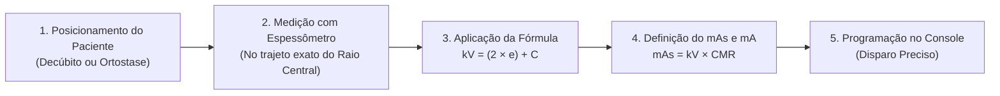
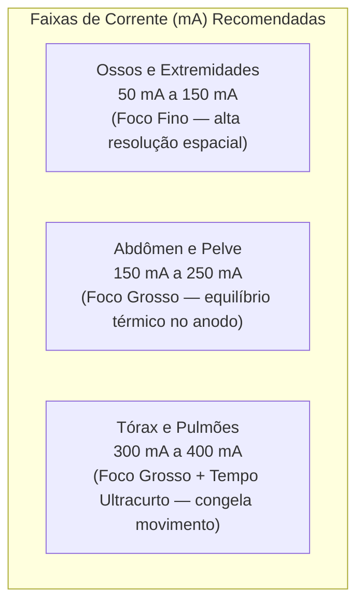

Na radiologia médica, a qualidade do exame diagnóstico e a proteção do paciente contra doses desnecessárias dependem diretamente de uma competência técnica fundamental: **o domínio dos cálculos operacionais de exposição**. 

Longe de ser uma atividade empírica de "tentativa e erro", a determinação dos fatores radiográficos é uma ciência física exata. Na aula do dia **19 de maio de 2026 da UC1** no Senac Campinas, estruturamos os pilares matemáticos que regem a seleção de Quilovoltagem ($kV$), Miliamperagem ($mA$), Tempo de Exposição ($t$) e Produto Corrente-Tempo ($mAs$).

---

## 1. O Espessômetro (Caliper): A Ferramenta de Medição Anatômica

O primeiro passo para qualquer cálculo de exposição em radiografia convencional ou digital é a mensuração precisa da espessura da estrutura anatômica a ser examinada.

### 📏 Como Utilizar Corretamente o Espessômetro?
1. **Trajeto do Feixe Central (RC):** A haste do espessômetro deve medir a espessura ($e$) em centímetros exatamente no ponto por onde incidirá o raio central (e não na borda ou na extremidade do membro).
2. **Sem Compressão Excessiva:** As lâminas do espessômetro devem tocar suavemente a pele do paciente, sem comprimir excessivamente os tecidos moles nem deixar folgas.
3. **Incidência Específica:** A espessura para uma incidência em **Ântero-Posterior (AP)** ou **Póstero-Anterior (PA)** é diferente da espessura em **Perfil (P)**. Cada projeção exige sua própria medição!

---

## 2. A Fórmula Fundamental da Tensão: $kV = (2 \times e) + C$

A **Quilovoltagem de Pico ($kV$)** determina o poder de penetração dos raios X (qualidade do feixe). Para que o feixe atravesse a densidade do paciente e atinja o receptor de imagem com energia adequada para gerar contraste diagnóstico, utilizamos a fórmula clássica:

$$kV = (2 \times e) + C$$

Onde:
* **$kV$**: Quilovoltagem necessária para a exposição.
* **$e$**: Espessura da estrutura anatômica em centímetros ($\text{cm}$), medida com o espessômetro.
* **$2$**: Coeficiente físico de atenuação linear médio dos tecidos biológicos humanos.
* **$C$**: **Constante do Aparelho** de raios X (fator de calibração do gerador e da linha de transmissão).

---

### ⚙️ O que é a Constante do Aparelho ($C$)?

A constante $C$ representa o rendimento elétrico do tubo, as perdas no transformador de alta tensão e a influência da grade antidifusora (*Bucky*):

* **Na Mesa / Bucky Mural (Com Grade Antidifusora):** A grade absorve parte da radiação primária junto com a dispersa. Por isso, a constante $C$ varia habitualmente entre **$25$ e $40$** (valor padrão didático de referência: **$C = 30$**).

---

## 3. Tabela Referencial de Espessuras Anatômicas Médias

No dia a dia e nos cálculos teóricos estruturados nas aulas práticas, adotamos a seguinte tabela de espessuras médias para adultos normolíneos:

| Estrutura Anatômica | Espessura Média ($e$) | Projeção Típica | $kV$ Estimado ($C=30$ no Bucky) |
| :--- | :---: | :---: | :---: |
| **Mão** | $05\text{ cm}$ | PA / Oblíqua | $30\text{ kV}$ *(sem grade)* |
| **Pé** | $08\text{ cm}$ | AP / Oblíqua | $36\text{ kV}$ *(sem grade)* |
| **Antebraço** | $10\text{ cm}$ | AP / Perfil | $40\text{ kV}$ *(sem grade)* |
| **Tornozelo** | $11\text{ cm}$ | AP / Perfil | $52\text{ kV}$ *(sem grade)* |
| **Cotovelo** | $12\text{ cm}$ | AP / Perfil | $54\text{ kV}$ *(sem grade)* |
| **Coluna Cervical** | $13\text{ cm}$ | AP | $56\text{ kV}$ *(no Bucky)* |
| **Ombro** | $16\text{ cm}$ | AP | $62\text{ kV}$ *(no Bucky)* |
| **Perna** | $16\text{ cm}$ | AP / Perfil | $62\text{ kV}$ *(sem grade)* |
| **Joelho** | $18\text{ cm}$ | AP / Perfil | $66\text{ kV}$ *(no Bucky)* |
| **Tórax** | $18\text{ cm}$ | PA | $66\text{ kV}$ *(no Bucky, $C=30$, DFO = 100 cm)* |
| **Coluna Dorsal (Torácica)** | $22\text{ cm}$ | AP | $74\text{ kV}$ *(no Bucky)* |
| **Crânio** | $25\text{ cm}$ | AP / Perfil | $80\text{ kV}$ *(no Bucky)* |
| **Abdômen** | $28\text{ cm}$ | AP | $86\text{ kV}$ *(no Bucky)* |
| **Coluna Lombar** | $30\text{ cm}$ | AP | $90\text{ kV}$ *(no Bucky)* |
| **Bacia (Pelve)** | $32\text{ cm}$ | AP | $94\text{ kV}$ *(no Bucky)* |

---

## 4. O Produto Corrente-Tempo ($mAs$) e a Constante de Miliamperagem Regional ($CMR$)

Enquanto o $kV$ regula a **qualidade** (penetrabilidade), o **$mAs$** regula a **quantidade total de fótons** emitidos pelo tubo de raios X, sendo o produto direto da corrente pelo tempo:

$$mAs = mA \times t$$

### O que é o $CMR$ (Coeficiente de Miliamperagem Regional)?
Para calcular o $mAs$ ideal a partir da tensão calculada ($kV$), utiliza-se a relação empírica:

$$mAs = kV \times CMR$$

| Região Anatômica | Fator $CMR$ Referencial | Justificativa Fisiológica / Física |
| :--- | :---: | :--- |
| **Estruturas Ósseas / Extremidades** | **$1,0$** | Tecido de alta densidade mineral (cálcio) exigindo alto contraste radiográfico e $mAs$ proporcional. |
| **Abdômen / Pelve** | **$0,8$** | Órgãos viscerais com tecidos moles de atenuação homogênea, exigindo $mAs$ balanceado para contraste tecidual. |
| **Pulmões / Tórax** | **$0,05$** | Parênquima pulmonar repleto de ar (baixa densidade radiográfica), exigindo baixíssimo $mAs$ para não queimar a imagem. |

---

## 5. Seleção Estratégica da Corrente ($mA$) e Cálculo do Tempo de Exposição ($t$)

No console do aparelho de raios X, o técnico programa o $kV$, o $mA$ e o tempo $t$. A escolha do $mA$ segue critérios clínicos rigorosos:

### A Fórmula do Tempo de Exposição:
Isolando o tempo $t$ na fórmula fundamental:

$$t = \frac{mAs}{mA}$$

* **Por que usar o maior $mA$ disponível para Tórax ($300 - 400\text{ mA}$)?**  
  Porque ao elevar a corrente ($mA$), o tempo de disparo $t$ cai para frações de centésimos de segundo ($\text{ex: } 0,01\text{ s}$ a $0,02\text{ s}$). Isso **congela o batimento cardíaco e a mecânica ventilatória**, eliminando o artefato de movimento (borramento cinético) na radiografia de tórax.

---

## 6. Exercícios Práticos Resolvidos Passo a Passo

Vamos aplicar a metodologia em 3 casos práticos típicos de rotina hospitalar:

### 🧩 Caso 1: Radiografia de Joelho AP no Bucky ($e = 18\text{ cm}$, $C = 30$)
1. **Cálculo da Tensão ($kV$):**
   $$kV = (2 \times e) + C = (2 \times 18) + 30 = 36 + 30 = 66\text{ kV}$$
2. **Cálculo do $mAs$ ($CMR = 1{,}0$ para osso):**
   $$mAs = kV \times CMR = 66 \times 1{,}0 = 66\text{ mAs}$$
3. **Seleção de Corrente e Tempo ($mA = 100\text{ mA}$ — Foco Fino):**
   $$t = \frac{mAs}{mA} = \frac{66}{100} = 0{,}66\text{ segundos}$$

---

### 🧩 Caso 2: Radiografia de Tórax PA ($e = 18\text{ cm}$, $C = 30$, $D = 100\text{ cm}$)
1. **Cálculo da Tensão ($kV$):**
   $$kV = (2 \times 18) + 30 = 66\text{ kV}$$
2. **Cálculo do $mAs$ ($CMR = 0,05$ para tórax):**
   $$mAs = 66 \times 0,05 = 3,3\text{ mAs} \approx 3,5\text{ mAs}$$
3. **Seleção de Alta Corrente ($mA = 350\text{ mA}$ para eliminar borramento):**
   $$t = \frac{mAs}{mA} = \frac{3,5}{350} = 0,01\text{ segundos (10 milissegundos!)}$$

---

### 🧩 Caso 3: Radiografia de Coluna Lombar AP ($e = 30\text{ cm}$, $C = 30$)
1. **Cálculo da Tensão ($kV$):**
   $$kV = (2 \times 30) + 30 = 60 + 30 = 90\text{ kV}$$
2. **Cálculo do $mAs$ ($CMR = 1{,}0$ — estrutura óssea espessa):**
   $$mAs = kV \times CMR = 90 \times 1{,}0 = 90\text{ mAs}$$
3. **Seleção de Corrente e Tempo ($mA = 200\text{ mA}$ — Foco Grosso):**
   $$t = \frac{mAs}{mA} = \frac{90}{200} = 0{,}45\text{ segundos}$$

---

## 📋 Resumo Operacional: O "Mapa de Bordo" do Técnico

| Parâmetro | O que Controla? | Como Calcular / Selecionar? |
| :---: | :--- | :--- |
| **$kV$** | Penetrabilidade e Contraste Radiográfico | $kV = (2 \times e) + C$ |
| **$mAs$** | Densidade Óptica e Quantidade de Fótons | $mAs = kV \times CMR$ ou tabelas institucionais |
| **$mA$** | Taxa de emissão de elétrons e escolha do ponto focal | Baixo ($50\text{–}150\text{ mA}$) p/ extremidades; Alto ($300\text{–}400\text{ mA}$) p/ tórax |
| **$t$** | Tempo de permanência do feixe ativo | $t = \frac{mAs}{mA}$ (sempre o menor possível para evitar borramento) |

**Constantes de Miliamperagem Regional (CMR) por Tipo de Tecido:**

| Tipo de Tecido / Região | $CMR$ | Justificativa |
| :--- | :---: | :--- |
| **Estruturas Ósseas** (extremidades, coluna, crânio) | **$1{,}0$** | Alta densidade mineral (cálcio) — máxima atenuação |
| **Tecidos Moles / Órgãos** (abdômen, pelve) | **$0{,}8$** | Atenuação homogênea de partes moles viscerais |
| **Pulmões / Tórax** | **$0{,}05$** | Parênquima aéreo de baixíssima densidade radiográfica |

---

## 💡 Conclusão

Compreender a matemática por trás da radiação é o que separa um operador mecânico de um verdadeiro **Técnico em Radiologia de Alta Performance**. 

Ao aplicar a equação $kV = 2e + C$ associada ao dimensionamento correto do $mAs$ e do tempo de exposição, garantimos imagens com excelente definição das trabéculas ósseas e interfaces de tecidos moles, respeitando rigorosamente o **Princípio ALARA** (*As Low As Reasonably Achievable*).

No próximo artigo (**Cálculos Operacionais II**), abordaremos os **fatores de compensação de dose**: pacientes com osteoporose, gesso, variações biométricas, uso de cilindros de extensão e a aplicação da **Lei do Inverso do Quadrado da Distância**!

---

## 📚 Referências

1. BONTRAGER, K. L.; LAMPIGNANO, J. P. **Tratado de Posicionamento Radiográfico e Correlação Anatômica**. 8. ed. Rio de Janeiro: Elsevier, 2015.
2. BUSHONG, S. C. **Ciência Radiológica para Tecnólogos: Física, Biologia e Proteção**. 10. ed. Rio de Janeiro: Elsevier, 2013.
3. BIASOLI, A. B. **Manual de Radiologia para Técnicos**. São Paulo: Atheneu, 2006.
4. BRASIL. Ministério da Saúde / ANVISA. **Resolução RDC nº 611, de 9 de março de 2022**: Requisitos sanitários para os serviços de saúde que utilizam equipamentos emissores de radiação ionizante para fins diagnósticos e intervencionistas. Brasília: ANVISA, 2022.
