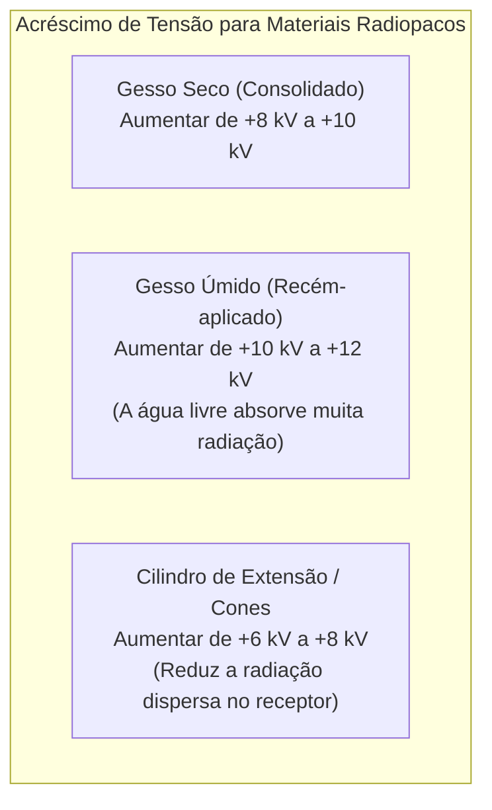
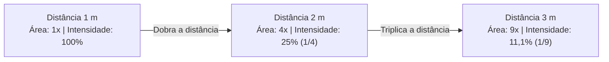

No primeiro artigo sobre cálculos operacionais, vimos como determinar a base técnica ideal através da espessura anatômica ($e$) e da constante do aparelho ($C$) pela fórmula $kV = 2e + C$, além de dimensionar o produto $mAs = mA \times t$.

Entretanto, na rotina hospitalar de urgência e emergência, o paciente real raramente se encaixa no padrão anatômico perfeito de livro. Pacientes chegam imobilizados com **gesso úmido ou seco**, idosos apresentam perda acentuada de densidade mineral óssea (**osteoporose**), e exames específicos (como o tórax) exigem **distâncias ampliadas para $1,80\text{ metro}$** para reduzir a magnificação cardíaca.

Na **aula do dia 22 de maio de 2026 da UC1**, estudamos a fundo os **Fatores de Compensação Técnica** e as **Leis Físicas da Distância**.

---

## 1. Compensações Patológicas e Biométricas

A interação dos raios X com a matéria ocorre em nível atômico. Tecidos com menor concentração de cálcio atenuam menos os fótons (menor absorção fotoelétrica), enquanto massas musculares hipertrofiadas impõem maior barreira à radiação:

*Projeção de aula: diretrizes de ajuste percentual e acréscimo de tensão conforme a densidade tecidual.*

### 👵 1. Pacientes Idosos e Osteoporose (Redução de $\approx 10\%$ no $kV$)
* **Fundamento Fisiológico:** A osteoporose causa desmineralização óssea progressiva (reabsorção de cálcio). Os ossos tornam-se mais radiotransparentes.
* **Conduta Técnica:** Se mantivermos a técnica de um adulto jovem, a radiografia ficará "queimada" (superpenetrada/hiperradiopaca). Deve-se **reduzir em aproximadamente $10\%$ o valor do $kV$ calculado**.
* **Cálculo:**
  $$kV_{\text{idoso}} = kV_{\text{base}} \times 0,90$$

---

### 🧬 2. Pacientes Orientais (Redução de $\approx 10\%$ no $kV$)
* **Fundamento Antropométrico:** Padrões biométricos e menor densidade de massa corporal média.
* **Conduta Técnica:** Recomenda-se reduzir em $\approx 10\%$ o valor do $kV$ para evitar sobreexposição desnecessária.

---

### 💪 3. Pacientes com Alta Densidade Muscular / Atletas ($+5\text{ kV}$)
* **Fundamento Físico:** O aumento da densidade e do volume muscular de tecidos moles compactos atenua significativamente o feixe primário.
* **Conduta Técnica:** O fenômeno não tem relação com pigmentação cutânea, e sim com densidade tecidual compacta. Deve-se **aumentar a técnica em $+5\text{ kV}$**.
* **Cálculo:**
  $$kV_{\text{muscular}} = kV_{\text{base}} + 5\text{ kV}$$

---

## 2. Compensações por Imobilizações e Acessórios Colimadores

Quando o feixe precisa atravessar materiais externos antes de atingir a estrutura de interesse, o técnico deve recalcular a absorção adicional:

*Fatores de acréscimo para aparelhos gessados úmidos/secos e cilindros de extensão.*

### 🩹 Imobilização com Gesso (Gesso Seco vs. Gesso Úmido)
1. **Gesso Seco ($+8\text{ a }+10\text{ kV}$):** O sulfato de cálcio seco confere resistência mecânica e atenuação radiológica moderada.
2. **Gesso Úmido ($+10\text{ a }+12\text{ kV}$):** O gesso recém-confeccionado retém grande quantidade de moléculas de água ($\text{H}_2\text{O}$), aumentando drasticamente a absorção por Efeito Compton e Fotoelétrico.
3. **Atenção Técnica em Talas Gessadas:** Em imobilizações parciais (talas em calha), observe se o gesso envolve toda a circunferência ou apenas uma das faces (ex: apenas a face posterior). Ajuste a compensação apenas se o feixe atravessar a face gessada!

---

### 🔦 Cilindros e Cones de Extensão ($+6\text{ a }+8\text{ kV}$)
O cilindro de extensão restringe geometricamente o feixe, eliminando grande parte da radiação espalhada periférica. Para manter a densidade óptica central da imagem diagnóstica, deve-se **aumentar a tensão de $6$ a $8\text{ kV}$**.

---

## 3. Variação de Distância (DFOFI) e a Lei do Inverso do Quadrado

A distância padrão entre o foco do tubo de raios X e o filme/receptor (DFOFI) para exames em mesa ou Bucky mural é de **$1,00\text{ metro}$ ($100\text{ cm}$)**.

No entanto, para exames de **Tórax**, a distância padrão é ampliada para **$1,80\text{ metro}$ ($180\text{ cm}$)** para neutralizar a magnificação cardíaca e obter o tamanho real da silhueta do coração.

*Regra prática de compensação de distância: +4 kV a cada 10 cm de afastamento da ampola.*

---

### 📏 Regra Prática de Compensação de Tensão por Distância
> **Regra de Ouro:** A cada **$10\text{ cm}$** que a ampola de raios X é afastada além do padrão ($100\text{ cm}$), deve-se **aumentar $4\text{ kV}$**. Se a ampola for aproximada, reduz-se $4\text{ kV}$ a cada $10\text{ cm}$.

* **Exemplo Clássico (Tórax a $1,80\text{ m}$):**
  * Distância padrão = $100\text{ cm}$
  * Distância real do Tórax = $180\text{ cm}$
  * Diferença de distância = $180 - 100 = 80\text{ cm}$
  * Variações de $10\text{ cm}$ = $\frac{80}{10} = 8\text{ passos}$
  * Acréscimo total = $8 \times 4\text{ kV} = \mathbf{+32\text{ kV}}$!

---

### 📐 A Física Fundamental: A Lei do Inverso do Quadrado da Distância

A intensidade da radiação ($I$) que atinge uma superfície é inversamente proporcional ao quadrado da distância ($D$) em relação à fonte puntiforme:

$$\frac{I_1}{I_2} = \frac{D_2^2}{D_1^2}$$

#### 🧮 Como Compensar o $mAs$ Quando a Distância Muda?
Para manter a mesma densidade óptica no receptor ao alterar a distância sem mexer no $kV$, aplicamos a **Lei Direta dos Quadrados para o $mAs$**:

$$\frac{mAs_1}{mAs_2} = \frac{D_1^2}{D_2^2} \implies mAs_2 = mAs_1 \times \left(\frac{D_2}{D_1}\right)^2$$

*Exemplo:* Se uma técnica exige $10\text{ mAs}$ a $100\text{ cm}$, qual será o $mAs$ necessário se mudarmos para $200\text{ cm}$?
$$mAs_2 = 10 \times \left(\frac{200}{100}\right)^2 = 10 \times (2)^2 = 10 \times 4 = \mathbf{40\text{ mAs}}$$

---

## 4. Tabela Síntese de Todas as Compensações Técnicas

| Fator / Condição Clínica | Ajuste no $kV$ | Observação Operacional |
| :--- | :---: | :--- |
| **Paciente Idoso / Osteoporose** | **$-10\%$** | Evita que o osso desmineralizado fique hiperpenetrado. |
| **Paciente Oriental** | **$-10\%$** | Adequação ao biotipo e densidade óssea média. |
| **Massa Muscular / Atleta** | **$+5\text{ kV}$** | Supera a maior atenuação dos tecidos moles compactos. |
| **Gesso Seco (Consolidado)** | **$+8\text{ a }+10\text{ kV}$** | Sulfato de cálcio desidratado sobre a estrutura. |
| **Gesso Úmido (Recente)** | **$+10\text{ a }+12\text{ kV}$** | Água retida amplifica o espalhamento Compton. |
| **Cilindro de Extensão** | **$+6\text{ a }+8\text{ kV}$** | Restrição de campo e remoção de radiação dispersa. |
| **Distância Focal (DFOFI)** | **$+4\text{ kV}$ a cada $10\text{ cm}$** | Variação linear prática para acréscimo além de $1\text{ m}$. |

---

## 5. Exercícios de Fixação Resolvidos Passo a Passo

### 🧩 Caso 1: Tornozelo AP com Gesso Seco ($e = 11\text{ cm}$, $C = 30$)
1. **$kV$ Base sem gesso:**
   $$kV_{\text{base}} = (2 \times 11) + 30 = 22 + 30 = 52\text{ kV}$$
2. **Compensação de Gesso Seco ($+10\text{ kV}$):**
   $$kV_{\text{final}} = 52 + 10 = \mathbf{62\text{ kV}}$$

---

### 🧩 Caso 2: Coluna Lombar AP em Paciente Idosa com Osteoporose ($e = 30\text{ cm}$, $C = 30$)
1. **$kV$ Base:**
   $$kV_{\text{base}} = (2 \times 30) + 30 = 60 + 30 = 90\text{ kV}$$
2. **Compensação por Osteoporose ($-10\%$):**
   $$kV_{\text{final}} = 90 - (90 \times 0,10) = 90 - 9 = \mathbf{81\text{ kV}}$$

---

### 🧩 Caso 3: Radiografia de Tórax PA a $1,80\text{ m}$ em Paciente Padrão ($e = 18\text{ cm}$, $C = 30$)
1. **$kV$ Base a $1,00\text{ m}$:**
   $$kV_{\text{base}} = (2 \times 18) + 30 = 36 + 30 = 66\text{ kV}$$
2. **Compensação de Distância ($100\text{ cm} \rightarrow 180\text{ cm} = +80\text{ cm} \rightarrow 8 \times 4\text{ kV} = +32\text{ kV}$):**
   $$kV_{\text{final}} = 66 + 32 = \mathbf{98\text{ kV}}$$
   *(Nota: Alternativamente, no padrão de alto $kV$ para tórax, utiliza-se entre $100\text{ kV}$ e $120\text{ kV}$ com grade Bucky e baixo $mAs$).*

---

## 💡 Conclusão

A precisão técnica na radiologia é uma garantia de saúde e segurança para o paciente. Saber calcular as compensações adequadas para cada cenário clínico é a marca do profissional qualificado que evita a repetição desnecessária de exames, honrando o **Princípio ALARA** e as diretrizes da **RDC ANVISA nº 611/2022** e da **CNEN NN 3.01**.

---

## 📚 Referências

1. BONTRAGER, K. L.; LAMPIGNANO, J. P. **Tratado de Posicionamento Radiográfico e Correlação Anatômica**. 8. ed. Rio de Janeiro: Elsevier, 2015.
2. BUSHONG, S. C. **Ciência Radiológica para Tecnólogos: Física, Biologia e Proteção**. 10. ed. Rio de Janeiro: Elsevier, 2013.
3. BIASOLI, A. B. **Manual de Radiologia para Técnicos**. São Paulo: Atheneu, 2006.
4. BRASIL. Ministério da Saúde / ANVISA. **Resolução RDC nº 611, de 9 de março de 2022**: Requisitos sanitários para os serviços de saúde que utilizam equipamentos emissores de radiação ionizante para fins diagnósticos e intervencionistas. Brasília: ANVISA, 2022.
5. BRASIL. Comissão Nacional de Energia Nuclear (CNEN). **Diretrizes Básicas de Proteção Radiológica — Norma CNEN NN 3.01**. Rio de Janeiro: CNEN, 2014.
