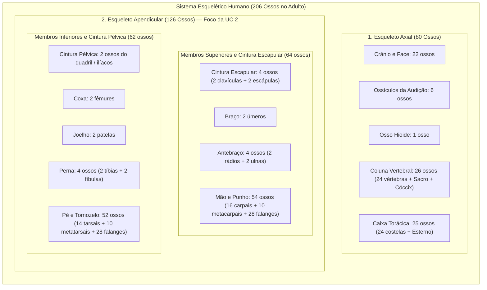
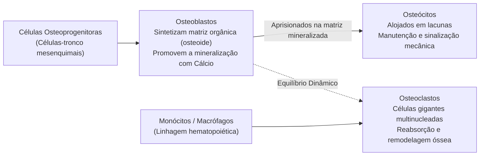
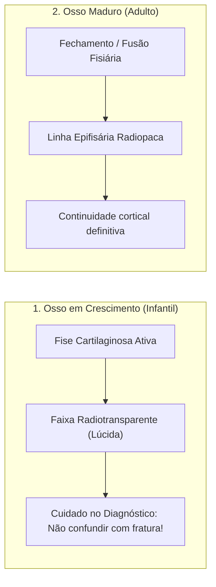
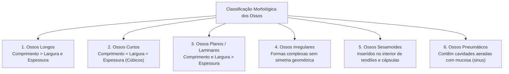
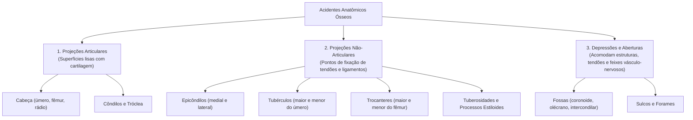
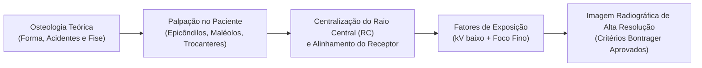

Na formação do técnico em radiologia, a **Unidade Curricular 2 (UC2)** marca a transição crucial entre os fundamentos físicos e de biossegurança (vistos na UC1) e a **execução técnica precisa dos exames de membros superiores (MMSS) e membros inferiores (MMII)**. 

Para posicionar um paciente com rigor milimétrico, colimar adequadamente o feixe primário e avaliar com olhar crítico uma imagem radiográfica, o profissional deve dominar a **osteologia descritiva e a anatomia radiológica**. Cada linha cortical, trabécula esponjosa e saliência óssea visível no filme ou detector digital possui significado biomecânico e patológico direto.

Neste artigo inaugural da UC2 no Senac, estruturamos os pilares da arquitetura esquelética: a contagem e divisão dos ossos, a histologia da matriz óssea, as fases de maturação (osso infantil vs. adulto), a classificação morfológica e o mapeamento dos acidentes ósseos que orientam a centralização do Raio Central (RC).

---

## 1. O Sistema Esquelético e a Divisão do Esqueleto Humano

O esqueleto humano de um indivíduo adulto completamente desenvolvido é composto por **206 ossos** constantes (além de ossos sesamoides e supranumerários eventuais). Em recém-nascidos e crianças, esse número ultrapassa **300 peças ósseas**, que gradualmente se fundem ao longo do crescimento e da maturação óssea (como ocorre nas vértebras sacrais, coccígeas e nos ossos que compõem o osso do quadril: ílio, ísquio e pube).

O esqueleto divide-se funcionalmente em dois grandes eixos:

> [!NOTE]
> **Foco Curricular da UC 2**: O aprendizado prático da UC2 concentra-se exatamente nos **126 ossos do Esqueleto Apendicular**. O técnico em radiologia aprende a individualizar cada uma das articulações e diáfises de extremidades por meio de incidências em plano ortogonal (pelo menos duas incidências perpendiculares entre si, como AP/PA e Perfil).

---

## 2. Histologia e Fisiologia Óssea: A Base da Radiodensidade

O osso não é uma estrutura mineral estática, mas sim um **tecido conjuntivo dinâmico, altamente vascularizado e em constante remodelação metabólica**.

### A. A Composição da Matriz Óssea
A matriz extracelular do tecido ósseo é composta por:
1. **Fração Orgânica (~35%)**: Constituída principalmente por **fibras colágenas (tipo I)** embebidas em substância fundamental amorfa (proteoglicanos e glicoproteínas). Confere ao osso sua **elasticidade, plasticidade e resistência a forças de tração e torção**.
2. **Fração Inorgânica (~65%)**: Formada por cristais de **hidroxiapatita de cálcio** $[Ca_{10}(PO_4)_6(OH)_2]$, além de íons de magnésio, potássio, sódio e carbonato. É essa densa deposição mineral que confere **rigidez estrutural, dureza mecânica e radiopacidade (brancura)** na imagem radiológica.

### B. A Tríade Celular do Tecido Ósseo

* **Osteoblastos**: Células jovens com intensa atividade sintética. Secretam o colágeno e as proteínas da matriz osteoide e participam ativamente da deposição e armazenamento de fosfato de cálcio.
* **Osteócitos**: A forma celular madura mais abundante. Ficam alojados no interior de pequenas cavidades denominadas **lacunas**, comunicando-se com células vizinhas através de canalículos citoplasmáticos. Atuam como sensores de estresse biomecânico, coordenando a resposta de reforço ósseo (Lei de Wolff).
* **Osteoclastos**: Células volumosas, móveis e multinucleadas derivadas da linhagem macrofágica. Secretam enzimas proteolíticas (como a colagenase) e ácidos que dissolvem a matriz inorgânica, promovendo a **reabsorção óssea**. São indispensáveis na modelagem de fraturas, na abertura do canal medular e na homeostase de cálcio plasmático.

---

## 3. Arquitetura Macroscópica de um Osso Longo

Os ossos longos constituem o esqueleto fundamental das extremidades (úmero, rádio, ulna, fêmur, tíbia, fíbula e falanges). Compreender suas porções anatômicas é essencial para laudar posicionamentos e descrever topograficamente lesões corticais ou fraturas.

### Componentes Estruturais:

1. **Epífise (Proximal e Distal)**: Extremidades expandidas do osso longo que participam das superfícies articulares. É constituída predominantemente por uma malha de **osso esponjoso (trabecular)** contendo medula óssea vermelha, revestida externamente por uma delgada camada de osso compacto e recoberta por **cartilagem hialina articular** (não visível em raios X convencionais, configurando o chamado "espaço articular radiográfico").
2. **Metáfise**: Zona de transição em forma de cone entre a epífise e a diáfise. É o local onde ocorre o crescimento longitudinal ativo em indivíduos jovens através da cartilagem de crescimento.
3. **Diáfise (Corpo)**: O eixo cilíndrico central do osso. É estruturada por uma parede espessa de **osso compacto (cortical)** de alta densidade, que envolve a **cavidade medular (canal medular)**. Na idade adulta, a cavidade medular diafisária abriga principalmente medula amarela (tecido adiposo).
4. **Periósteo**: Membrana conjuntiva fibrosa e densa que reveste todas as superfícies ósseas externas, exceto onde há cartilagem articular. Possui uma camada externa rica em vasos sanguíneos e nervos (altamente sensível à dor em traumas) e uma camada interna celular rica em osteoblastos, responsável pelo **crescimento em espessura (crescimento aposicional)** e pela formação do calo ósseo pós-fratura.
5. **Endósteo**: Fina membrana de tecido conjuntivo que reveste internamente o canal medular e as cavidades do osso esponjoso, também contendo osteoblastos e osteoclastos.
6. **Forame Nutrício e Artéria Nutrícia**: Abertura oblíqua na cortical diafisária que dá passagem aos vasos nutridores principais. **Atenção radiológica**: o trajeto do canal nutrício na radiografia pode eventualmente ser confundido com um traço de fratura capilar por olhos desatentos.

---

## 4. O Marco Radiológico: Osso Infantil vs. Osso Adulto

Uma das competências mais exigidas nas aulas práticas do laboratório de radiologia é a diferenciação precisa entre um esqueleto em desenvolvimento e um esqueleto maduro.

### A Cartilagem de Crescimento (Fise / Placa Epifisária)
* **No Osso Infantil**: Entre a epífise e a metáfise existe uma faixa de cartilagem hialina ativa denominada **placa epifisária (fise)**. Como a cartilagem possui densidade radiológica equivalente à água/partes moles ($Z$ baixo), ela **não atenua significativamente os raios X**, aparecendo na radiografia como uma **linha radiotransparente (escura)** bem delimitada.
* **No Osso Adulto**: Quando o crescimento longitudinal cessa (geralmente entre os 16 e 21 anos, dependendo da região anatômica e do sexo), a cartilagem epifisária sofre completa mineralização e fechamento. No local, resta apenas uma estreita faixa condensada de osso trabecular conhecida como **linha epifisária (radiopaca/esbranquiçada)**.

> [!WARNING]
> **Atenção ao Diagnóstico de Trauma Pediátrico**: Em pacientes pediátricos politraumatizados, o técnico deve manter atenção redobrada à centralização e à colimação. Fraturas que acometem a placa de crescimento recebem a classificação de **Salter-Harris** (Tipos I a V). Uma lesão fisiária não diagnosticada ou manipulada de forma inadequada pode causar parada precoce do crescimento e deformidade angular do membro.

---

## 5. Classificação Morfológica dos Ossos

Os 206 ossos do corpo humano são classificados em categorias morfológicas baseadas na relação proporcional entre suas três dimensões no espaço: **comprimento**, **largura** e **espessura**.

### Quadro Sistemático de Classificação Óssea

| Classificação | Relação Dimensional | Arquitetura Interna Típica | Exemplos em MMSS / MMII / Esqueleto | Relevância no Posicionamento Radiográfico |
| :--- | :--- | :--- | :--- | :--- |
| **Osso Longo** | Comprimento acentuadamente superior à largura e espessura. | Duas epífises de osso esponjoso e uma diáfise de osso compacto com canal medular central. | **MMSS**: Úmero, rádio, ulna, metacarpos e falanges. **MMII**: Fêmur, tíbia, fíbula, metatarsos e falanges. | Devem ser radiografados incluindo **obrigatoriamente as duas articulações adjacentes** (proximal e distal) em casos de trauma. |
| **Osso Curto** | Dimensões homogêneas; formato cúbico ou poliédrico ($C \approx L \approx E$). | Núcleo central de osso esponjoso envolto por fina casca cortical compacta. | **MMSS**: 8 ossos do carpo (escafoide, semilunar, piramidal, etc.). **MMII**: 7 ossos do tarso (calcâneo, tálus, navicular, etc.). | Exigem incidências oblíquas específicas e colimação estrita para desassociar sobreposições complexas. |
| **Osso Plano (Laminar)** | Comprimento e largura equivalentes, predominando sobre a espessura delgada. | Duas tábuas paralelas de osso compacto ensanduichando uma camada central de osso esponjoso (*díploe*). | **MMSS**: Escápula. **Outros**: Clavícula (alongado plano), Esterno, Costelas, Ílio e ossos da calota craniana (parietal, frontal). | Protegem órgãos vitais e fornecem amplas áreas para inserção muscular. Avaliados em incidências tangenciais e oblíquas. |
| **Osso Irregular** | Formas geométricas complexas e assimétricas que não se enquadram nas classes anteriores. | Mistura variável de osso esponjoso envolto por casca cortical fina. | **MMII / Pelve**: Ísquio, pube, sacro e cóccix. **Outros**: Vértebras cervicais, torácicas, lombares e ossos da base do crânio (esfenoide, etmoide). | Exigem angulações cefálicas ou podálicas precisas do Raio Central (como incidências de *Inlet* e *Outlet* na bacia). |
| **Osso Sesamoide** | Pequenos nódulos ovóides ou arredondados desenvolvidos no interior de tendões sujeitos a grande atrito e tensão mecânica. | Osso esponjoso revestido por cartilagem articular em suas faces de deslizamento. | **MMII**: Patela (o maior do corpo), sesamoides do hálux (medial/tibial e lateral/fibular) e a *Fabela* (inconstante). **MMSS**: Sesamoides da cabeça do 1º metacarpo. | Modificam o ângulo de tração dos tendões e evitam desgaste por atrito. Exigem incidências axiais (ex: axiais de patela e sesamoides do hálux). |
| **Osso Pneumático** | Ossos ocos que abrigam cavidades revestidas por mucosa contendo ar (*seios ou sinus*). | Paredes ósseas delgadas delimitando cavidades pneumatizadas conectadas às vias aéreas. | Crânio e face: Seio Maxilar, Frontal, Esfenoidal, Etmoidal e células mastóideas do temporal. | Devem ser examinados preferencialmente com **feixe horizontal e paciente ereto (em pé ou sentado)** para demonstrar **níveis hidroaéreos** (líquido/ar). |

---

## 6. Acidentes Anatômicos de Extremidades: Os Guias do Posicionamento

Na rotina clínica, o técnico em radiologia raramente "enxerga" o osso do paciente antes do disparo. O profissional orienta-se pela **palpação de marcos anatômicos de superfície** e pelo alinhamento de **acidentes anatômicos ósseos**.

Os acidentes ósseos dividem-se em elevações articulares, projeções para inserção muscular/ligamentar e depressões/reentrâncias:

### Dicionário de Acidentes Ósseos Aplicado às Extremidades

1. **Cabeça (*Caput*)**: Extremidade articular globosa e arredondada, frequentemente sustentada por um colo estreitado.
   * *Exemplos*: Cabeça do úmero (articula-se com a cavidade glenoide da escápula), cabeça do fêmur (articula-se com o acetábulo), cabeça do rádio (articula-se com o capítulo umeral e incisura radial da ulna).
2. **Côndilo**: Grande projeção articular arredondada e convexa, normalmente encontrada em pares nas extremidades distais de ossos de sustentação de peso.
   * *Exemplos*: Côndilos femorais medial e lateral (apoiam-se nos platôs tibiais para formar a articulação fêmoro-tibial).
3. **Epicôndilo**: Projeção ou eminência óssea localizada **imediatamente acima de um côndilo**, servindo de ancoragem ligamentar e muscular.
   * *Exemplos*: Epicôndilos umerais medial e lateral no cotovelo; epicôndilos femorais medial e lateral no joelho. Na radiografia em AP de cotovelo, a linha interepicondilar deve estar estritamente paralela ao receptor de imagem.
4. **Tubérculo**: Pequena elevação ou projeção óssea arredondada não-articular.
   * *Exemplos*: Tubérculo maior e tubérculo menor do úmero proximal. A rotação externa do ombro evidencia o tubérculo maior em perfil lateral; a rotação interna projeta o tubérculo menor medialmente.
5. **Trocanter**: Elevação volumosa, robusta e irregular, exclusiva da extremidade proximal do fêmur.
   * *Exemplos*: **Trocanter Maior** (ponto de palpação fundamental no quadril correspondente ao nível superior do pube e sínfise púbica) e **Trocanter Menor** (localizado póstero-medialmente; na radiografia em AP de bacia com rotação interna dos pés a 15°-20°, o trocanter menor deve ficar quase totalmente encoberto pelo colo femoral).
6. **Tuberosidade**: Projeção óssea rugosa e alongada, de volume intermediário entre o tubérculo e o trocanter.
   * *Exemplos*: Tuberosidade da tíbia (fixação do ligamento patelar), tuberosidade bicipital do rádio, tuberosidade do 5º metatarso (sítio frequente de fratura por avulsão do músculo fibular curto — Fratura de Jones).
7. **Processo Estiloide**: Projeção óssea afilada em forma de espícula.
   * *Exemplos*: Processo estiloide do rádio e processo estiloide da ulna no punho. O processo estiloide radial projeta-se cerca de 1 a 1,5 cm mais distalmente que o estiloide ulnar, parâmetro essencial na avaliação de fraturas de punho (Fratura de Colles).
8. **Maléolos**: Projeções ósseas em forma de martelo que delimitam a pinça articular do tornozelo (*mortise*).
   * *Exemplos*: Maléolo medial (extremidade distal da tíbia) e Maléolo lateral (extremidade distal da fíbula). Na radiografia de rotina, o maléolo lateral desce mais distalmente e localiza-se ligeiramente mais posterior que o medial.
9. **Fossa**: Depressão ou concavidade óssea ampla, frequentemente rasa.
   * *Exemplos*: Fossa do olécrano (face posterior da extremidade distal do úmero), fossa intercondilar do fêmur (abriga os ligamentos cruzados no joelho, evidenciada no método de Holmblad/Camp-Coventry).
10. **Sulco (*Sulcus*)**: Ranhura ou depressão linear que acomoda um tendão, nervo ou vaso sanguíneo.
    * *Exemplos*: Sulco intertubercular (bicipital) do úmero proximal, onde desliza o tendão da cabeça longa do bíceps braquial.

---

## 7. Física Radiológica das Extremidades: Atenuação Fotoelétrica e Fatores de Exposição

Nas radiografias de extremidades (mão, dedos, pé, tornozelo e punho), a espessura tecidual é relativamente pequena (geralmente entre 2 e 8 cm). Isso permite explorar ao máximo os princípios físicos da formação de imagem:

### A. Efeito Fotoelétrico e Alto Contraste Radiográfico
No tecido ósseo, a absorção dos raios X ocorre primordialmente através do **Efeito Fotoelétrico**, cuja probabilidade de ocorrência varia proporcionalmente ao cubo do número atômico do material ($Z^3$) e inversamente proporcional ao cubo da energia do feixe ($1/E^3$):

$$\text{Probabilidade de Interação Fotoelétrica} \propto \frac{Z^3}{E^3}$$

Como o cálcio do osso possui número atômico elevado ($Z_{\text{Cálcio}} = 20$; $Z_{\text{efetivo do osso}} \approx 13,8$) em comparação com as partes moles e músculos vizinhos ($Z_{\text{efetivo partes moles}} \approx 7,4$), a diferença de atenuação é expressiva:

* **Empregando Baixo $kV$ (40 a 55 $kV$)**: Maximizamos a proporção de interações fotoelétricas em detrimento do espalhamento Compton. O resultado é uma imagem com **alto contraste intrínseco (escala curta de cinzas)**, permitindo visualizar com nitidez a transição abrupta entre a cortical compacta radiopaca e os planos fasciais e gordurosos adjacentes.
* **Foco Fino ($0,6\text{ mm}$)**: Como as extremidades demandam baixa corrente e tempos curtos ($mAs$ baixo, entre 1,5 e 5 $mAs$), utiliza-se **sempre o filamento menor do catodo**. Isso reduz sensivelmente a penumbra geométrica ($P_g$), proporcionando **máxima resolução espacial e nitidez dos detalhes trabeculares**.

---

## 8. Critérios de Avaliação de Imagem (Bontrager) em Osteologia de Extremidades

Ao avaliar uma radiografia de extremidades no negatoscópio ou monitor diagnóstico, o técnico deve aplicar a metodologia padronizada de controle de qualidade:

1. **Estrutura Anatômica Completa**: O osso de interesse deve estar representado em sua totalidade, incluindo a articulação proximal e a articulação distal (para ossos longos) ou todo o complexo poliarticular (carpo/tarso).
2. **Ausência de Rotação Indesejada**: Os acidentes ósseos simétricos (ex: epicôndilos femorais ou umerais) devem apresentar distância equivalente em relação ao receptor, evidenciando ausência de rotação acidental.
3. **Penetração e Densidade Adequadas**: A cortical óssea deve apresentar margens nítidas e densas, enquanto o trabeculado esponjoso deve ser claramente discernível sem apresentar subexposição (imagem granular/"esbranquiçada") ou superexposição (imagem "queimada" com perda de partes moles).
4. **Visualização de Partes Moles**: As linhas de gordura periarticulares e o contorno muscular devem ser preservados, pois o deslocamento dessas linhas adiposas (*fat pads*) frequentemente constitui o único indício radiográfico indireto de uma fratura oculta ou derrame articular.
5. **Colimação Rigorosa**: O campo luminoso deve limitar-se estritamente à área anatômica de interesse em todos os 4 lados, minimizando a dose no paciente (ALARA) e reduzindo a radiação secundária espalhada que degrada o contraste da imagem.

---

## 9. Síntese Prática: Do Conceito Anatômico ao Posicionamento

Compreender a morfologia, a arquitetura interna e as fases de maturação dos ossos é a fundação sólida sobre a qual todas as rotinas técnicas da UC2 são construídas. Nas próximas postagens práticas, aplicaremos esses conceitos no posicionamento detalhado dos **pododáctilos, pé, retropé, tornozelo, joelho e membros superiores**.

---

### 📚 Referências Técnicas Consultadas:
* **BONTRAGER, Kenneth L.; LAMPIGNANO, John P.** *Tratado de Técnica Radiológica e Base Anatômica*. 9ª e 10ª Edições. Rio de Janeiro: Elsevier / Guanabara Koogan.
* **BUSHONG, Stewart Carlyle.** *Ciência Radiológica para Tecnólogos: Física, Biologia e Proteção*. 11ª Edição. Rio de Janeiro: Elsevier.
* **BIASOLI JÚNIOR, Antonio.** *Técnicas Radiográficas: Princípios Físicos, Anatomia Básica e Posicionamento*. 2ª Edição. Rio de Janeiro: Rubio.
* **DRAKE, Richard L.; VOGL, A. Wayne; MITCHELL, Adam W. M.** *Gray's Anatomia para Estudantes*. 4ª Edição. Rio de Janeiro: Elsevier.
* **SENAC SP.** *Plano de Curso e Práticas Laboratoriais da Unidade Curricular 2 (Técnico em Radiologia)*.
