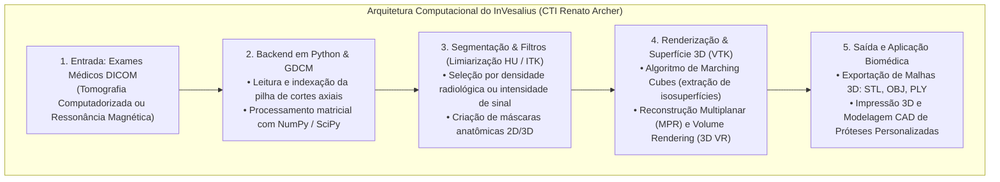
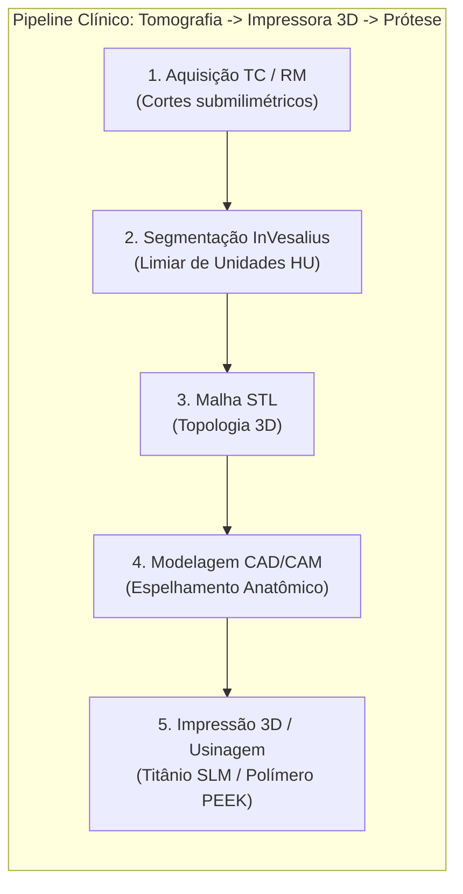

*Registro no CIW 2026: biomodelos anatômicos de tórax, coluna vertebral e estruturas craniofaciais impressos a partir de tomografias computadorizadas.*

Como desenvolvedor de software aficionado por tecnologia e código, eu simplesmente não podia deixar de acompanhar a **Campinas Innovation Week (CIW 2026)**, realizada no histórico Pátio Ferroviário de Campinas/SP.

Havia dezenas de projetos incríveis espalhados pelos estandes de robótica e inteligência artificial, mas um deles me chamou a atenção mais do que todos os outros: o estande do **CTI Renato Archer (Centro de Tecnologia da Informação Renato Archer — MCTI)** apresentando o **Programa ProMED** e o software público brasileiro **InVesalius**.

Ali vivenciei um daqueles momentos em que duas paixões da minha trajetória se encontraram com clareza total: o universo da **Engenharia de Software** e a formação na **Radiologia Médica**.

Quando você atua na interseção entre tecnologia e saúde, a sua régua de impacto muda: cada linha de código e cada parâmetro de aquisição na sala de tomografia deixam de ser rotina operacional e passam a representar cuidado direto, precisão cirúrgica e vidas humanas.

---

## 🔬 1. O Software InVesalius: Da Engenharia em Python à Medicina 3D

Criado em **2001** no âmbito do **ProMED** (Programa de Pesquisa, Desenvolvimento e Inovação em Aplicações de Tecnologias 3D na Medicina/Saúde), o **InVesalius** (homenagem a Andreas Vesalius, pai da anatomia moderna) é distribuído gratuitamente sob licença de código aberto (**GNU GPLv2**), é utilizado em mais de **170 países** e conta com participação recorrente no prestigioso programa internacional **Google Summer of Code (GSoC)**.

### Principais Pilares da Stack Tecnológica:
* **Linguagem Principal**: **Python**, garantindo arquitetura limpa, modularidade e integração rápida com algoritmos científicos.
* **Manipulação de DICOM**: Integração com a biblioteca **GDCM (Grassroots DICOM)** para decodificação eficiente de metadados clínicos e matrizes de atenuação.
* **Computação Científica & Álgebra Linear**: Uso de **NumPy** e **SciPy** para processamento vetorial de alta performance dos voxels volumétricos.
* **Processamento Gráfico e Visão Tridimensional**: Uso do **VTK (Visualization Toolkit)** para renderização volumétrica e extração de malhas poligonais pelo algoritmo de *Marching Cubes*.
* **Interface Multiplataforma**: Construída em **wxPython**, permitindo interface gráfica nativa em Linux, Windows e macOS.

---

## 🦴 2. Da Imagem Radiológica à Prótese Sob Medida

A biblioteca estabelece um fluxo determinístico e preciso que converte o exame realizado na sala de radiologia em um implante cirúrgico de titânio:

### 1. Segmentação por Unidades Hounsfield (HU) na Tomografia:
O operador ou cirurgião seleciona a faixa de densidade radiológica no InVesalius para individualizar tecidos específicos:
* **Tecido Ósseo Compacto e Esponjoso**: $+200\text{ a }+3000\text{ HU}$;
* **Tecidos Moles e Músculos**: $+20\text{ a }+80\text{ HU}$;
* **Vasos com Contraste Iodado (Angiotomografia)**: $+150\text{ a }+500\text{ HU}$ (permitindo isolar aneurismas e malformações vasculares cerebrais ou aórticas).

### 2. Segmentação em Ressonância Magnética (RM):
Para tecidos moles sem densidade óssea acentuada (como fibrocartilagens articulares, discos intervertebrais, meniscos e tumores de partes moles), o software opera com gradientes de contraste em sequências $T1$, $T2$ e densidade de prótons.

### 3. Modelagem de Próteses Personalizadas (Cranioplastias e Bucomaxilofacial):
Em pacientes que sofreram perda óssea extensa (por exemplo, traumatismo craniano grave ou ressecção tumoral mandibular):
1. O InVesalius gera a malha 3D da falha óssea;
2. Em software CAD, realiza-se o **espelhamento digital da anatomia contralateral saudável** para desenhar o implante perfeito;
3. O arquivo é enviado para manufatura aditiva direta em **Titânio grau médico (fusão seletiva a laser / SLM)** ou **polímero PEEK**, resultando em uma prótese com encaixe anatômico perfeito.

---

## 🏥 3. O Impacto Social do Programa ProMED no SUS

O trabalho pioneiro do CTI Renato Archer com o SUS ao longo de mais de duas décadas consolidou avanços cirúrgicos extraordinários:

1. **Biomodelos Anatômicos 1:1**: Réplicas físicas esterilizáveis que o cirurgião manipula no centro cirúrgico. Permite a **pré-moldagem de placas e parafusos de fixação antes da incisão cirúrgica**.
2. **Redução do Tempo Cirúrgico e Anestésico**: Cirurgias de alta complexidade (como osteotomias pélvicas, deformidades craniofaciais e separação de gêmeos siameses) têm o tempo de mesa reduzido em até **duas horas (30% a 50%)**.
3. **Segurança do Paciente e Economia de Recursos**: Menor tempo cirúrgico traduz-se em menor sangramento, menor necessidade de transfusões de sangue, menor risco de infecção hospitalar e desospitalização mais precoce.

---

## 💡 4. O Papel Estratégico do Técnico em Radiologia

Para que a biblioteca do InVesalius e os centros de biomanufatura consigam produzir modelos e próteses com precisão milimétrica, a qualidade do exame gerado pelo técnico em radiologia na ponta é o fator determinante:

* **Voxel Isotrópico ($x = y = z$)**: O operador deve parametrizar cortes finos ($\le 0,5\text{ a }1,0\text{ mm}$) e matriz adequada ($512\times 512$), evitando o efeito de serrilhado/degrau (*step artifacts*) na reconstrução tridimensional.
* **Posicionamento e Estabilidade**: Qualquer micro-movimento do paciente durante o *scan* introduz artefatos de borramento que distorcem o cálculo da malha poligonal.
* **Visão Além da Tela**: Compreender que o arquivo DICOM exportado não é uma foto estática, mas um conjunto de coordenadas espaciais e biomédicas fundamentais para a cirurgia personalizada.

---

## 📚 Referências Consolidadas

* INVESALIUS. **InVesalius 3: Software Livre de Reconstrução Tridimensional de Imagens Médicas**. Campinas: Centro de Tecnologia da Informação Renato Archer (CTI/MCTI), 2026. Disponível em: <https://invesalius.github.io/>.
* SILVA, Jorge Vicente Lopes da; et al. **Tecnologias 3D na Saúde: Da Tomografia à Bioimpressão**. Campinas: CTI Renato Archer / MCTI, 2022.
* BONTRAGER, Kenneth L.; LAMPIGNANO, John P. **Tratado de Posicionamento Radiográfico e Anatomia Associada**. 10. ed. Rio de Janeiro: Elsevier, 2023.
* BUSHONG, Stewart C. **Ciência Radiológica para Tecnólogos: Física, Biologia e Proteção Radiológica**. 12. ed. Rio de Janeiro: Elsevier, 2019.
* BRASIL. Ministério da Ciência, Tecnologia e Inovação (MCTI). **ProMED: Tecnologias 3D aplicadas à Medicina e Saúde Pública**. Brasília: MCTI, 2024.

