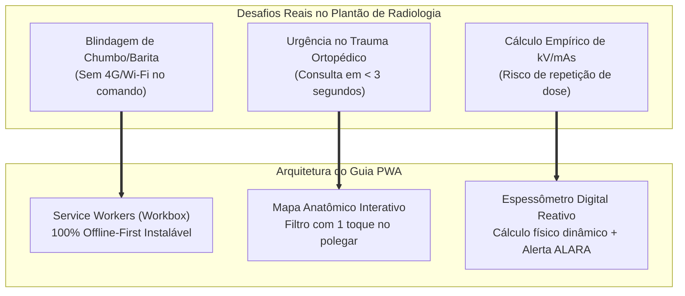
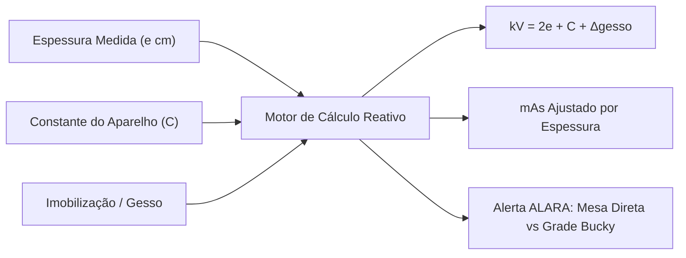
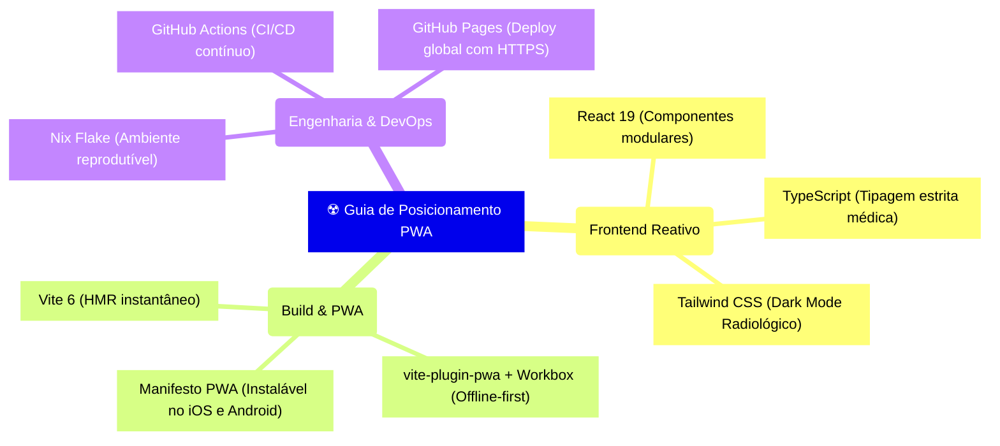

Na rotina de qualquer hospital ou clínica de diagnóstico por imagem, existe um rito de passagem universal: todo estudante de radiologia e profissional em início de plantão carrega no bolso do jaleco um caderninho encadernado, cheio de anotações manuais — a famosa **"colinha de posicionamento"**.

Nela estão rabiscadas as angulações de Raio Central (RC), distâncias foco-receptor (DFR), tamanhos de chassi, incidências especiais de trauma e as fórmulas para cálculo de $kV$ e $mAs$.

Como desenvolvedor de software em formação técnica no Senac, olhei para aquele pedaço de papel amassado e me fiz uma pergunta óbvia: **por que não transformar esse conhecimento canônico em uma aplicação web progressiva (PWA) moderna, rápida, reativa e 100% offline-first?**

Assim nasceu o **Guia de Posicionamento Radiográfico & Espessômetro Digital**.

---

## 🛑 O Desafio Técnico: O "Efeito Bunker" e a Sala de Exames

Desenvolver software para a área da saúde impõe restrições severas que a maioria dos apps convencionais ignora:

1. **O Efeito Bunker (Sem Conexão):** Salas de raios X, tomografia e hemodinâmica possuem paredes baritadas e portas blindadas com lençóis de chumbo. Esse isolamento atua como uma Gaiola de Faraday acidental, degradando ou cortando totalmente o sinal 4G/5G e Wi-Fi. Um app que dependa de requisições de rede falha no momento mais crítico do plantão.
2. **Tempo de Resposta em Emergências (Trauma):** No pronto-socorro, com um paciente politraumatizado na maca, não há tempo para folhear livros de 800 páginas (como o clássico *Tratado de Bontrager*) ou esperar um app pesado carregar telas.
3. **Cálculo Empírico vs. Rigor ALARA:** Estimar a técnica de exposição "no olho" resulta em imagens sub ou sobreexpostas, gerando repetições desnecessárias e dose excessiva de radiação ionizante no paciente.



---

## ⚡ As 4 Funcionalidades Principais da Aplicação

### 1. 🧍 Mapa Anatômico Interativo (Silhueta Humana)
Em vez de menus dropdown tradicionais e lentos, a tela inicial apresenta uma silhueta anatômica vetorial interativa:
* Toque nos **braços** → filtra instantaneamente incidências de **Membros Superiores (MMSS)**: dedos, mão, punho, antebraço, cotovelo e úmero.
* Toque nas **pernas** → abre os protocolos de **Membros Inferiores (MMII)**: pododáctilos, pé, calcâneo, tornozelo, perna, joelho e fêmur.
* Toque na **pelve** ou no **tórax** → navegação direta para cintura pélvica, escapular e caixa torácica.

---

### 2. 📐 Espessômetro Digital & Calculadora de Fatores de Exposição
A aplicação transforma o smartphone em uma ferramenta de física radiológica aplicada:



* **Fórmula de Biagio Automatizada:**
  $$kV = (2 \times e) + C + \Delta_{gesso}$$
* **Persistência da Constante do Gerador ($C$):** Cada sala possui uma calibração própria. O técnico ajusta a constante $C$ uma única vez e ela fica salva no navegador (`localStorage`).
* **Compensação Dinâmica para Gesso:** Fatores de correção para talas gessadas úmidas ($+4\text{ a }+6\text{ kV}$) e gesso seco.

---

### 3. 🛡️ Guardião ALARA & Seleção Automática de Grade Bucky
O princípio **ALARA** (*As Low As Reasonably Achievable*) determina que a dose no paciente seja a menor possível para obter imagem diagnóstica:
* Para espessuras **$e \le 10\text{ cm}$** e **$kV \le 60$**: o app indica **Exame em Mesa Direta (Sem Grade)**, alertando que o uso de grade aumentaria a dose desnecessariamente.
* Para espessuras **$e > 10\text{ cm}$** ou **$kV > 60$**: o app aciona o alerta de **Grade Bucky Obrigatória**, evitando a perda de contraste causada pela radiação espalhada (Efeito Compton).

---

### 4. 📋 Atlas com 38 Protocolos Canônicos (Bontrager 10ª Edição)
Cada incidência conta com uma ficha técnica completa:
* **Raio Central (RC):** Ponto de incidência exato e angulação cefálica ou podálica em graus.
* **Geometria:** DFR recomendada (100 cm para rotinas; 180 cm para telerradiografias de tórax) e tamanho/orientação do chassi.
* **Critérios de Avaliação:** Checklist dos elementos anatômicos que obrigatoriamente devem estar visíveis para a imagem ser considerada aprovada.
* **Incidências Especiais de Trauma:** Protocolos como *Método de Stecher* (escafoide), *Método de Gaynor-Hart* (túnel do carpo), *Perfil em Y de Ombro* (Neer), *Escanometria de Farill* e *Método de Judet* (acetábulo).

---

## 🏗️ Arquitetura Tecnológica: Stack Padrão Ouro



### Modelagem Estrita de Dados Médicos (TypeScript)

Para evitar erros em parâmetros críticos de exame, todas as estruturas são fortemente tipadas:

```typescript
export type RegiaoAnatomica = 
  | 'MMSS' 
  | 'MMII' 
  | 'Cintura Escapular & Tórax' 
  | 'Bacia & Pelve' 
  | 'Coluna Vertebral' 
  | 'Crânio & Face';

export interface IncidenciaRadiografica {
  id: string;
  nome: string;
  regiao: RegiaoAnatomica;
  subregiao: string;
  tipo: 'Rotina' | 'Especial / Trauma';
  
  // Parâmetros Físicos
  espessuraMediaCm: number;
  masBase: number;
  dffCm: number;
  tamanhoChassi: string;
  gradeRecomendada: boolean;
  
  // Orientação do Feixe
  raioCentral: {
    direcao: string;
    angulacao: string;
    pontoIncidencia: string;
  };
  
  criteriosAceitacao: string[];
  cuidadosProtecao: string[];
}
```

---

## 🎨 Sistema de Design: "Radiology Dark Mode"

A interface foi projetada especificamente para o ambiente de trabalho do técnico:
* **Fundo Escuro Profundo (`#090d16` / `#131b2e`):** Preserva a adaptação visual do profissional em salas de exames em penumbra e postos de comando.
* **Acentos em Ciano e Esmeralda:** Alta legibilidade de parâmetros radiográficos à distância.
* **Controles Otimizados para Toque:** Botões largos de incremento (`+` e `-`) que facilitam a operação mesmo durante uso com luvas de procedimento.

---

## 🌐 Como Acessar e Instalar

O projeto é **100% gratuito e de código aberto**, hospedado diretamente no GitHub Pages:

👉 **Acesse o App:** [https://henriquefreire.github.io/guia-posicionamento-radiografico/](https://henriquefreire.github.io/guia-posicionamento-radiografico/)

### Como instalar no celular (Como App Nativo):
1. Abra o link no navegador do celular (Chrome ou Safari).
2. No menu do navegador, toque em **"Adicionar à Tela de Início"** (ou *"Instalar Aplicativo"*).
3. O ícone do app aparecerá na tela do seu smartphone e funcionará perfeitamente **mesmo sem internet ou em modo avião dentro da sala de comando**.

---

## 💡 Conclusão

Este projeto sintetiza perfeitamente o propósito da minha jornada **#RoadToCRTR**: unir a engenharia de software à prática do diagnóstico por imagem para criar ferramentas que melhorem a precisão técnica, acelerem o fluxo de trabalho e reforcem a proteção radiológica de quem cuida e de quem é cuidado.

---

### 📚 Referências Bibliográficas e Normativas

1. **BONTRAGER, Kenneth L.; LAMPIGNANO, John P.** *Tratado de Posicionamento Radiográfico e Anatomia Associada*. 10. ed. Rio de Janeiro: Elsevier, 2021.
2. **BUSHONG, Stewart C.** *Ciência Radiológica para Tecnólogos: Física, Biologia e Proteção*. 10. ed. Rio de Janeiro: Elsevier, 2017.
3. **BIASOLI, Nair Schiavon.** *Radiologia — Técnicas Radiográficas*. 5. ed. São Paulo: Santos, 2009.
4. **AGÊNCIA NACIONAL DE VIGILÂNCIA SANITÁRIA (ANVISA).** *Resolução RDC nº 611: Estabelece os requisitos sanitários para a organização e o funcionamento de serviços de radiologia diagnóstica ou intervencionista*. Brasília: ANVISA, 2022.
5. **W3C.** *Progressive Web App Architecture and Service Worker Specifications*. W3C Working Group, 2023.
